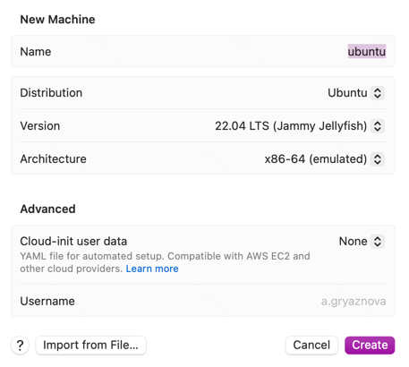
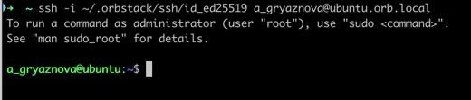
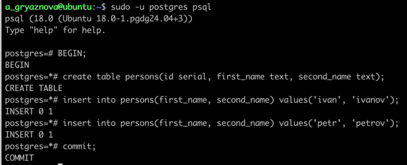
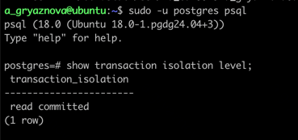
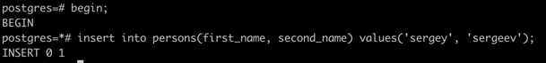
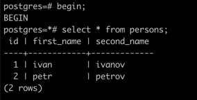
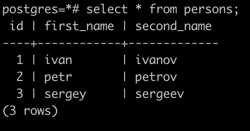
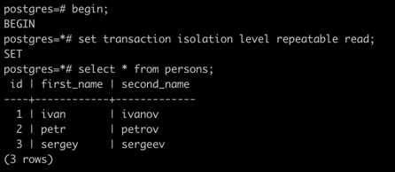
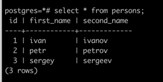
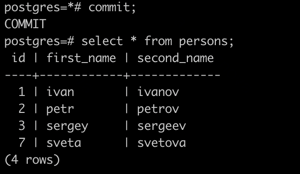

### 1. Установка виртуальной машины Ubuntu 24.04

Установка виртуальной машины в OrbStack



### 2. Вход по ssh(первая сессия)

````
ssh -i ~/.orbstack/ssh/id_ed25519 a_gryaznova@ubuntu.orb.local
````



### 3. Установка PostgreSQL

Инструкция по установке - https://www.postgresql.org/download/linux/ubuntu/

````
# Import the repository signing key:
sudo apt install curl ca-certificates
sudo install -d /usr/share/postgresql-common/pgdg
sudo curl -o /usr/share/postgresql-common/pgdg/apt.postgresql.org.asc --fail https://www.postgresql.org/media/keys/ACCC4CF8.asc

# Create the repository configuration file:
. /etc/os-release
sudo sh -c "echo 'deb [signed-by=/usr/share/postgresql-common/pgdg/apt.postgresql.org.asc] https://apt.postgresql.org/pub/repos/apt $VERSION_CODENAME-pgdg main' > /etc/apt/sources.list.d/pgdg.list"

# Update the package lists:
sudo apt update
````

````
sudo apt install postgresql-18
````


### 4. Создание базы данных и таблицы

````
sudo -u postgres psql
````

````
begin;
create table persons(id serial, first_name text, second_name text);
insert into persons(first_name, second_name) values('ivan', 'ivanov');
insert into persons(first_name, second_name) values('petr', 'petrov');
commit;
````



### 5. Вход по ssh(вторая сессия)

````
ssh -i ~/.orbstack/ssh/id_ed25519 a_gryaznova@ubuntu.orb.local
````

Текущий уровень изоляции - read committed

````
show transaction isolation level;
````



### 6. Новая транзакция в обеих сессиях с дефолтным уровнем изоляции

Первая сессия

````
begin;
insert into persons(first_name, second_name) values('sergey', 'sergeev');
````



Вторая сессия

````
begin;
select * from persons;
````



## Видите ли вы новую запись и если да то почему?

Нет, вторая сессия не видит изменения, сделанные первой сессией, потому что уровень изоляции по умолчанию - read
committed.
Уровень изоляции **read committed** не допускает чтения незафиксированных данных. Т.е. если в одной сессии мы сделали
изменения, то в другой сессии мы не можем их увидеть.

### 7. Завершение транзакции в первой сессии

Первая сессия

````
commit;
````

Вторая сессия

````
select * from persons;
````



## Видите ли вы новую запись и если да то почему?

Да, потому что уровень изоляции **read committed** предполагает, что транзакции видят зафиксированные данные. Поскольку
в первой сессии изменения были закоммичены, то они видны во второй сессии.

### 8. Изменение уровня изоляции

Первая сессия

````
begin;
insert into persons(first_name, second_name) values('sveta', 'svetova');
````

Вторая сессия

````
begin;
set transaction isolation level repeatable read;
select * from persons;
````



## Видите ли вы новую запись и если да то почему?

Нет, вторая сессия не видит изменения, сделанные первой сессией, потому что уровень изоляции **repeatable read** не
допускает чтения незафиксированных данных.

### 9. Завершение транзакции в первой сессии

Первая сессия

````
commit;
````

Вторая сессия

````
select * from persons;
````



## Видите ли вы новую запись и если да то почему?

Нет, вторая сессия не видит изменения, сделанные первой сессией, потому что уровень изоляции **repeatable read**
гарантирует, что при повторном чтении одной и той же записи транзакция получит те же самые значения.

### 9. Завершение транзакции во второй сессии

Вторая сессия

````
commit;
select * from persons;
````



## Видите ли вы новую запись и если да то почему?
Да, потому что данные были зафиксированны во второй сессии.
