### 1. Установка виртуальной машины Ubuntu 24.04

Установка виртуальной машины в OrbStack

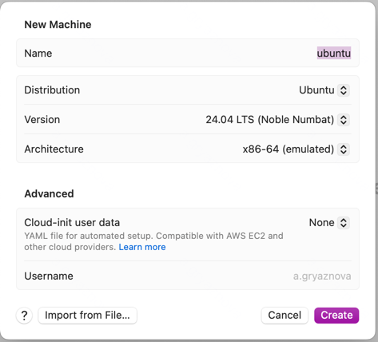

### 2. Вход по ssh

````
ssh -i ~/.orbstack/ssh/id_ed25519 a_gryaznova@ubuntu.orb.local
````

### 3. Установка Docker

Инструкция по установке - https://docs.docker.com/engine/install/ubuntu/

Настройка и обновление пакетов

````
# Add Docker's official GPG key:
sudo apt-get update
sudo apt-get install ca-certificates curl
sudo install -m 0755 -d /etc/apt/keyrings
sudo curl -fsSL https://download.docker.com/linux/ubuntu/gpg -o /etc/apt/keyrings/docker.asc
sudo chmod a+r /etc/apt/keyrings/docker.asc

# Add the repository to Apt sources:
echo \
  "deb [arch=$(dpkg --print-architecture) signed-by=/etc/apt/keyrings/docker.asc] https://download.docker.com/linux/ubuntu \
  $(. /etc/os-release && echo "${UBUNTU_CODENAME:-$VERSION_CODENAME}") stable" | \
  sudo tee /etc/apt/sources.list.d/docker.list > /dev/null
sudo apt-get update
````

Установка Docker Engine

````
sudo apt-get install docker-ce docker-ce-cli containerd.io docker-buildx-plugin docker-compose-plugin
sudo systemctl status docker
sudo systemctl start docker
sudo docker run hello-world
````

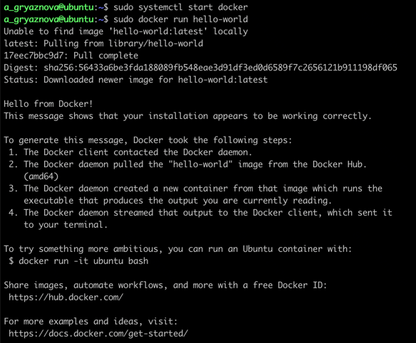

### 4. Создание контейнера с PostgreSQL

````
mkdir docker-postgres
vi docker-compose.yaml
````

[docker-compose.yaml](docker-compose.yaml)

````
services:
  db:
    image: postgres:18
    restart: unless-stopped
    container_name: otus-postgres
    environment:
      POSTGRES_USER: postgres
      POSTGRES_PASSWORD: postgres
      POSTGRES_DB: otus-db
    ports:
      - "5435:5432"
    volumes:
      - db:/var/lib/postgresql

volumes:
  db:
````

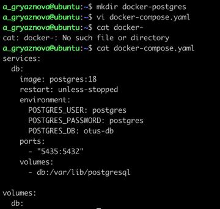

````
sudo docker compose up -d
````

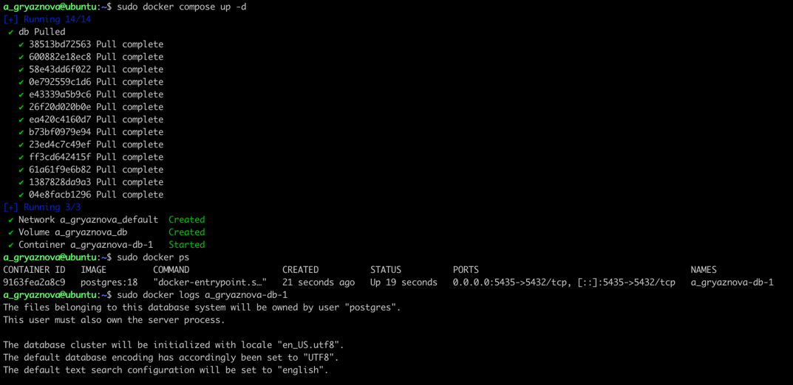

### 5. Создание контейнера с клиентом postgres

````
sudo docker run -it --rm --name pg-client --network a_gryaznova_default postgres:18 psql -h otus-postgres -U postgres
````

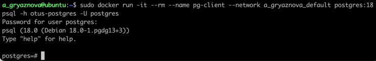

### 6. Создание базы данных и таблицы

````
create table persons(id serial, first_name text, second_name text);
insert into persons(first_name, second_name) values('ivan', 'ivanov');
insert into persons(first_name, second_name) values('petr', 'petrov');
````

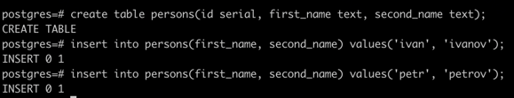

### 7. Подключение к контейнеру с локальной машины

1. Разрешить внешние подключения в конфигурационном файле pg_hba.conf. Добавить строку:

````
sudo docker exec -it otus-postgres bash -c 'echo "host all all 0.0.0.0/0 md5" >> $(psql -U postgres -t -c "SHOW hba_file;")'
````


2. Узнать IP-адрес виртуальной машины

````
orb list
````

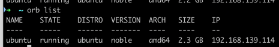

3. Подключиться к базе данных с локальной машины

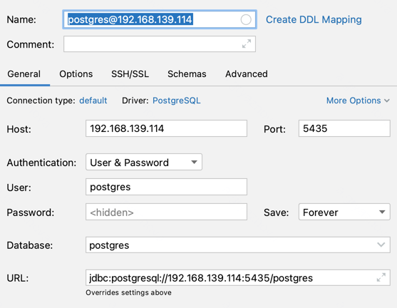

Просмотр базы данных

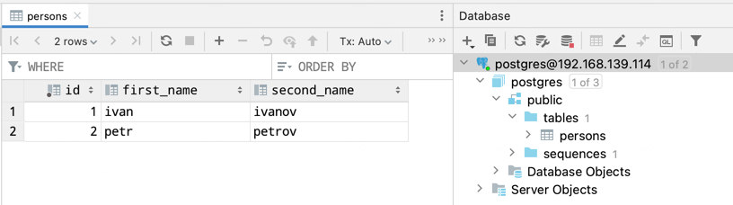

### 8. Удаление контейнера с PostgreSQL

````
sudo docker stop otus-postgres
sudo docker rm otus-postgres
sudo docker ps
````

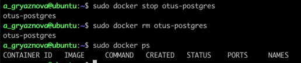

### 9. Создание контейнера с PostgreSQL

````
sudo docker compose up -d
````

### 10. Подключение к контейнеру с клиентa postgres

````
sudo docker run -it --rm --name pg-client --network a_gryaznova_default postgres:18 psql -h otus-postgres -U postgres
````

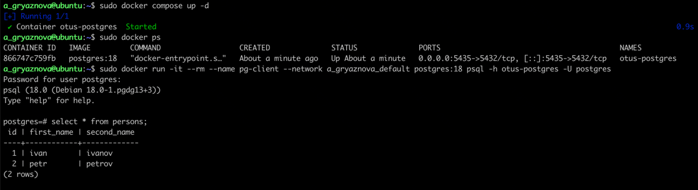

Данные остались на месте и не потерялись. 