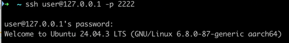
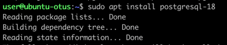
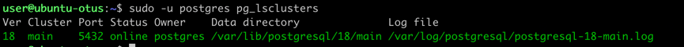
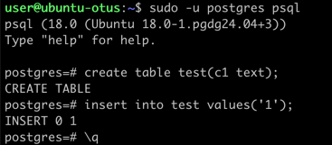
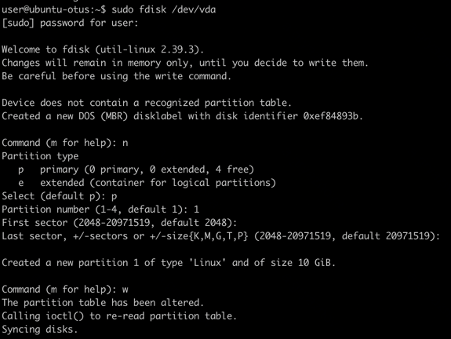
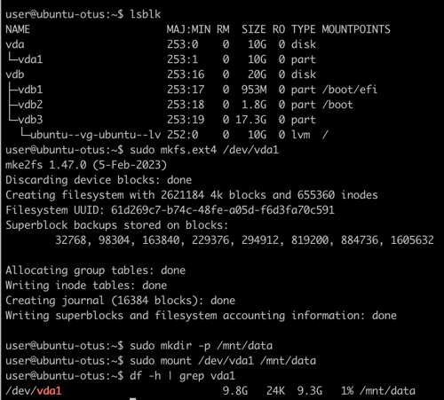
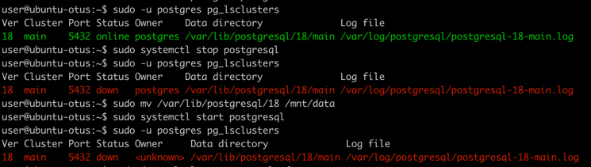
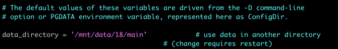
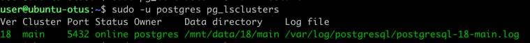
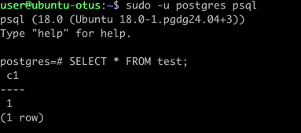

### 1. Установка виртуальной машины Ubuntu 24.04

Установка виртуальной машины через QEMU

````
qemu-img create -f raw ubuntu.raw 20G
qemu-system-aarch64 \
    -monitor stdio \
    -M virt,highmem=off \
    -accel hvf \
    -cpu host \
    -smp 4 \
    -m 3000 \
    -bios QEMU_EFI.fd \
    -device virtio-gpu-pci \
    -display default,show-cursor=on \
    -device qemu-xhci \
    -device usb-kbd \
    -device usb-tablet \
    -device intel-hda \
    -device hda-duplex \
    -drive file=ubuntu.raw,format=raw,if=virtio,cache=writethrough \
    -cdrom ubuntu-24.04.3-live-server-arm64.iso
````

### 2. Запуск виртуальной машины

````
qemu-system-aarch64 \
  -M virt \
  -cpu cortex-a72 \
  -smp 4 \
  -m 2G \
  -nographic \
  -bios QEMU_EFI.fd \
  -drive file=ubuntu.raw,format=raw,if=none,id=hd0 \
  -device virtio-blk-device,drive=hd0 \
  -netdev user,hostfwd=tcp:127.0.0.1:2222-:22,id=net0 \
  -device virtio-net-pci,netdev=net0
````

### 3. Вход по ssh

````
ssh user@127.0.0.1 -p 2222
````



### 4. Установка PostgreSQL

Инструкция по установке - https://www.postgresql.org/download/linux/ubuntu/

````
# Import the repository signing key:
sudo apt install curl ca-certificates
sudo install -d /usr/share/postgresql-common/pgdg
sudo curl -o /usr/share/postgresql-common/pgdg/apt.postgresql.org.asc --fail https://www.postgresql.org/media/keys/ACCC4CF8.asc

# Create the repository configuration file:
. /etc/os-release
sudo sh -c "echo 'deb [signed-by=/usr/share/postgresql-common/pgdg/apt.postgresql.org.asc] https://apt.postgresql.org/pub/repos/apt $VERSION_CODENAME-pgdg main' > /etc/apt/sources.list.d/pgdg.list"

# Update the package lists:
sudo apt update
````

````
sudo apt install postgresql-18
````



### 5. Проверка, что кластер запущен

````
sudo -u postgres pg_lsclusters
````



### 4. Зайти из под пользователя postgres

Сделайте произвольную таблицу с произвольным содержимым:

````
sudo -u postgres psql
create table test(c1 text);
insert into test values('1');
\q
````



### 5. Остановить postgres

````
sudo -u postgres pg_ctlcluster 18 main stop
````

### 6. Создайте новый диск к ВМ размером 10GB

````
qemu-img create -f raw ubuntu.raw 10G
````

Запуск с новым диском

````
qemu-system-aarch64 \
  -M virt \
  -cpu cortex-a72 \
  -smp 4 \
  -m 2G \
  -nographic \
  -bios QEMU_EFI.fd \
  -drive file=ubuntu.raw,format=raw,if=none,id=hd0 \
  -drive file=extra-disk.raw,format=raw,if=none,id=hd1 \
  -device virtio-blk-device,drive=hd0 \
  -device virtio-blk-device,drive=hd1 \
  -netdev user,hostfwd=tcp:127.0.0.1:2222-:22,id=net0 \
  -device virtio-net-pci,netdev=net0
````

Подключение диска к ВМ

````
sudo fdisk /dev/vda
````



````
sudo mkfs.ext4 /dev/vda1
````

Монтирование диска

````
sudo mkdir -p /mnt/data
sudo mount /dev/vda1 /mnt/data
````



### 7. Переместите содержимое /var/lib/postgres/18 в /mnt/data

1. Cделайте пользователя postgres владельцем /mnt/data

````
sudo chown -R postgres:postgres /mnt/data/
````

2. Перенесите содержимое /var/lib/postgres/15 в /mnt/data

````
sudo mv /var/lib/postgresql/18 /mnt/data
````

3. Попытайтесь запустить кластер

````
sudo -u postgres pg_ctlcluster 18 main start

Error: /var/lib/postgresql/18/main is not accessible or does not exist
````



Не удалось запустить кластер, потому что файлы были перенесены и конфигурационный файл запуска ссылается на старые пути.

### 8. Изменение конфигурационного параметра
````
vi /etc/postgresql/18/main/postgresql.conf
````
Поменять
> data_directory = '/var/lib/postgresql/18/main'

на
> data_directory = '/mnt/data/18/main'




Запуск кластера
````
sudo -u postgres pg_ctlcluster 15 main start
````


Кластер запустился, поскольку теперь указан корректный путь.


#### 9. Проверка содержимого ранее созданной таблицы

````
sudo -u postgres psql
SELECT * FROM test;
````


