### 1. Установка виртуальной машины Ubuntu 24.04

Установка виртуальной машины в OrbStack


### 2. Вход по ssh

````
ssh -i ~/.orbstack/ssh/id_ed25519 a_gryaznova@ubuntu.orb.local
````


### 3. Установка PostgreSQL

Инструкция по установке - https://www.postgresql.org/download/linux/ubuntu/

````
# Import the repository signing key:
sudo apt install curl ca-certificates
sudo install -d /usr/share/postgresql-common/pgdg
sudo curl -o /usr/share/postgresql-common/pgdg/apt.postgresql.org.asc --fail https://www.postgresql.org/media/keys/ACCC4CF8.asc

# Create the repository configuration file:
. /etc/os-release
sudo sh -c "echo 'deb [signed-by=/usr/share/postgresql-common/pgdg/apt.postgresql.org.asc] https://apt.postgresql.org/pub/repos/apt $VERSION_CODENAME-pgdg main' > /etc/apt/sources.list.d/pgdg.list"

# Update the package lists:
sudo apt update
````

````
sudo apt install postgresql-18
````

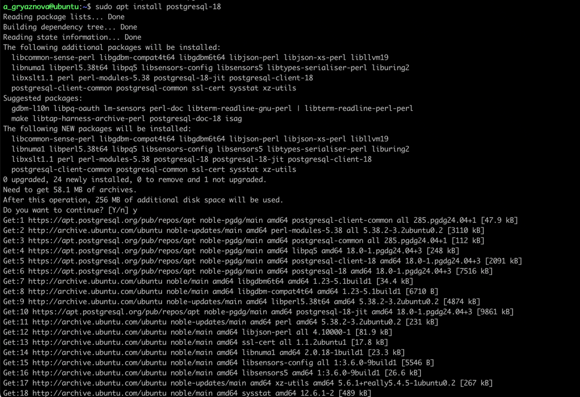

### 4. Cоздание новой базы данных testdb

````
sudo -u postgres psql
CREATE DATABASE testdb;
````

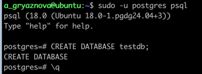

### 5. Зайдите в созданную базу данных под пользователем postgres

````
sudo -u postgres psql testdb
````

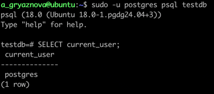

### 6. создайте новую схему testnm

````
CREATE SCHEMA testnm;
````

### 7. создайте новую таблицу t1 с одной колонкой c1 типа integer

````
CREATE TABLE testnm.t1 (c1 integer);
````

_Делая домашнее задание, подумала, что таблицу нужно создать в схеме testnm, поэтому сделала так.
Возможно, чтобы не путать в дальнейшем учеников можно поменять местами пункты 6 и 7._

### 8. вставьте строку со значением c1=1

````
INSERT INTO testnm.t1 VALUES (1);
````

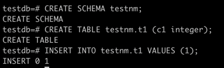

### 9. создайте новую роль readonly

````
CREATE ROLE readonly;
````

### 10. дайте новой роли право на подключение к базе данных testdb

````
GRANT CONNECT ON DATABASE testdb TO readonly;
````

### 11. дайте новой роли право на использование схемы testnm

````
GRANT USAGE ON SCHEMA testnm TO readonly;
````

### 12. дайте новой роли право на select для всех таблиц схемы testnm

````
GRANT SELECT ON ALL TABLES IN SCHEMA testnm TO readonly;
````

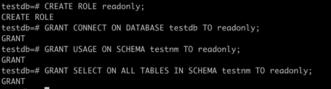

### 13. создайте пользователя testread с паролем test123

````
CREATE USER testread WITH PASSWORD 'test123';
````

### 14. дайте роль readonly пользователю testread

````
GRANT readonly TO testread;
````


### 15. зайдите под пользователем testread в базу данных testdb

````
psql -U testread -d testdb
````

Были проблемы с подключением, поэтому пришлось менять настройки pg_hba.conf по умолчанию.

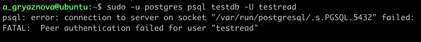

### 16. Сделайте `SELECT * FROM t1;`

Поскольку таблица t1 находится в схеме testnm, необходимо было явно её указать:

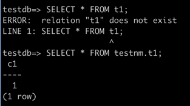

Пользователь testread имеет права на чтение всех таблиц в схеме testnm. Таблица t1 была созданна в схеме testnm, поэтому
попытка чтения из таблицы с указанием схемы удалась.

### 17. Посмотрите на список таблиц.

````
\dt
\dt testnm.*
````

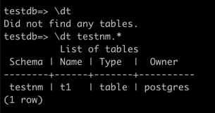

### 18. Вернитесь в базу данных `testdb` под пользователем `postgres`.

````
sudo -u postgres psql testdb
````

### 19. Удалите таблицу `t1`.

````
DROP TABLE testnm.t1;
````

### 20. Создайте её заново, но уже с явным указанием имени схемы: `testnm.t1`.

Поскольку изначально делала ее в схеме testnm, то сейчас сделаю без явного указания:

````
CREATE TABLE t1 (c1 integer);
INSERT INTO t1 VALUES (1);
````

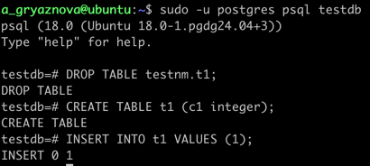

### 21. Зайдите под пользователем `testread` в базу данных `testdb`.

````
\c testdb testread
````

### 22. Сделайте `SELECT * FROM testnm.t1;`

````
SELECT * FROM t1;
````

Возвращается ошибка

````
testdb=> SELECT * FROM t1;
ERROR:  permission denied for table t1
````

Поскольку пользователь testread имеет права только на чтение таблиц в схеме testnm, то попытка чтения из схемы public
завершается ошибкой.

Можно либо дать пользователю testread права на чтение таблиц в схеме public, либо создать роль на чтение таблиц в схеме
public. Либо добавить роли readonly прав на select для всех таблиц схемы public(или всх схем).

````
GRANT SELECT ON ALL TABLES IN SCHEMA public TO readonly;
````

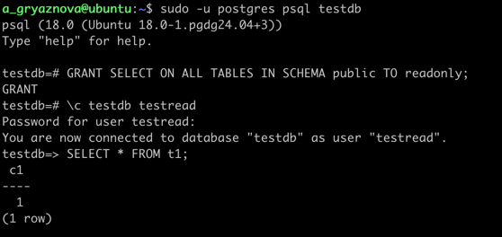

### 23. Теперь попробуйте выполнить команду:

````
CREATE TABLE t2(c1 integer); 
INSERT INTO t2 VALUES (2);
````

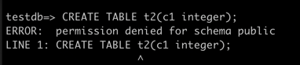

Не получается потому что, пользователь testread не имеет прав на создание таблиц в схеме public.