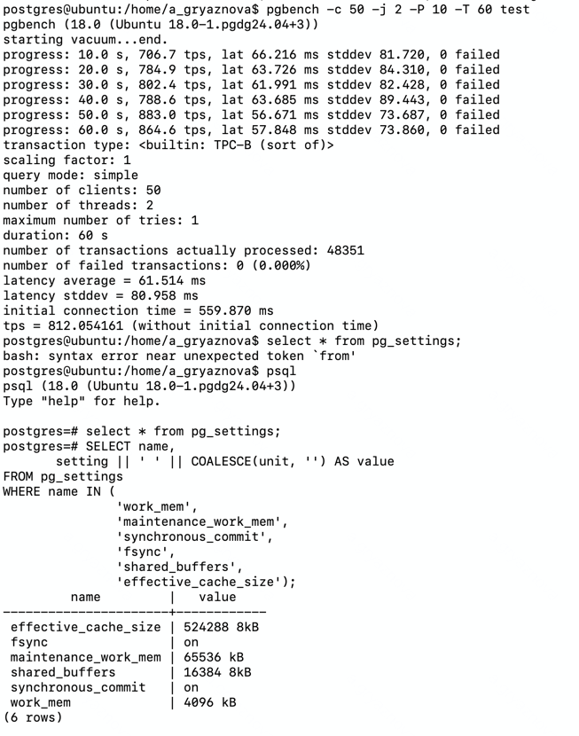
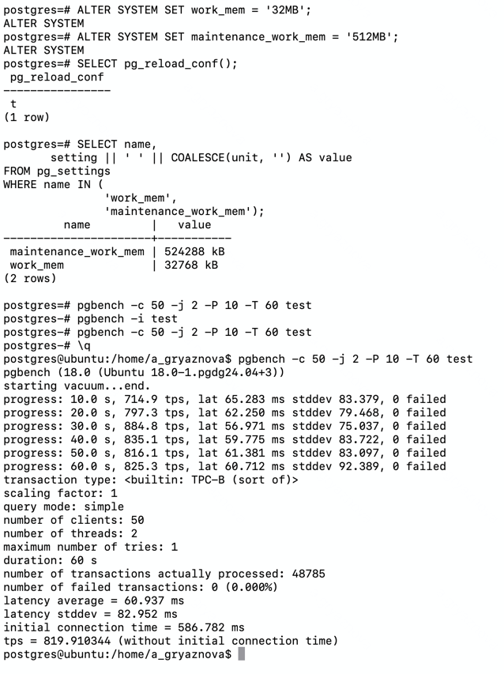
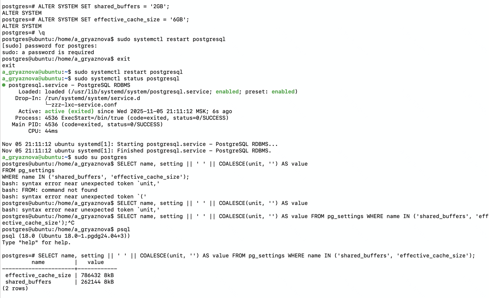
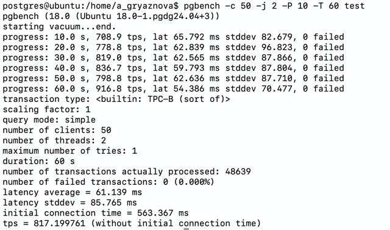

### 1. Измерим изначальную производительность на виртуальной машине.

````
pgbench -c 50 -j 2 -P 10 -T 60 test
````

Тестирование и изначальные параметры

````
SELECT name,
       setting || ' ' || COALESCE(unit, '') AS value
FROM pg_settings
WHERE name IN (
               'work_mem',
               'maintenance_work_mem',
               'synchronous_commit',
               'fsync',
               'shared_buffers',
               'effective_cache_size');
````

| name                 | value      |
|----------------------|------------|
| effective_cache_size | 524288 8kB |
| fsync                | on         |
| maintenance_work_mem | 65536 kB   |    
| shared_buffers       | 16384 8kB  |
| synchronous_commit   | on         |  
| work_mem             | 4096 kB    |



**Получили tps = 812**

### 2. Попробуем изменить параметры backend memory:

````
ALTER SYSTEM SET work_mem = '32MB';
ALTER SYSTEM SET maintenance_work_mem = '512MB';
SELECT pg_reload_conf();
SELECT name, setting || ' ' || COALESCE(unit, '') AS value
FROM pg_settings
WHERE name IN ('work_mem','maintenance_work_mem');
````

И снова проведем тестирование

````
pgbench -c 50 -j 2 -P 10 -T 60 test
````


**Получаем tps = 819.9**

### 3. Попробуем изменить параметры shared memory:

Изменение параметра shared_buffers требует перезагрузки сервера.

````
ALTER SYSTEM SET shared_buffers = '2GB';
ALTER SYSTEM SET effective_cache_size = '6GB';
sudo systemctl restart postgresql
sudo systemctl status postgresql
````

Проверим параметры:

````
sudo su postgres
SELECT name, setting || ' ' || COALESCE(unit, '') AS value
FROM pg_settings
WHERE name IN ('shared_buffers', 'effective_cache_size');
````



Проведем тестирование

````
pgbench -c 50 -j 2 -P 10 -T 60 test
````



**Получаем tps = 817**. Увеличение параметров shared memory не дало прироста производительности.

### 4. Попробуем изменить настройки дисковой подсистемы:

````
ALTER SYSTEM SET fsync = off;
ALTER SYSTEM SET synchronous_commit = 'off';
SELECT pg_reload_conf();
````

Проверим параметры:

````
SELECT name, setting || ' ' || COALESCE(unit, '') AS value
FROM pg_settings
WHERE name IN ('fsync', 'synchronous_commit');
````

Проведем тестирование

````
pgbench -c 50 -j 2 -P 10 -T 60 test
````


**Получаем tps = 2816!**.

Параметры дисковой подсистемы дали значительный прирост производительности. Но это не лучшее решение, так как мы можем
потерять данные.

