### 1. Установка виртуальной машины в Yandex Cloud


### 2. Подключение к виртуальной машине

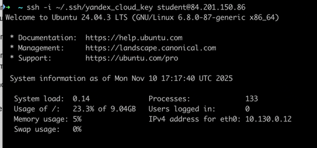

### 3. Установка PostgreSQL

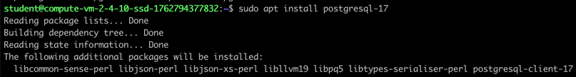

### 4. Создание тестовой БД с помощью `pgbench`

```
sudo -u postgres psql
CREATE DATABASE test;
pgbench -i test
```

**Результат:**

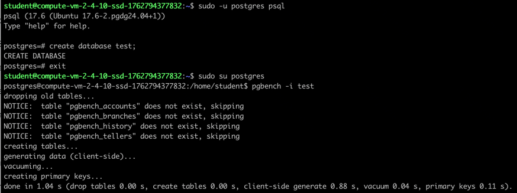

### 5. Запуск бенчмарка `pgbench`

```
pgbench -c8 -P 6 -T 60 -U postgres test
```

**Результат:**

- TPS: **411**


### 6. Применение параметров PostgreSQL

**Настройки:**

```sql
ALTER SYSTEM SET max_connections = 40;
ALTER SYSTEM SET shared_buffers = '1GB';
ALTER SYSTEM SET effective_cache_size = '3GB';
ALTER SYSTEM SET maintenance_work_mem = '512MB';
ALTER SYSTEM SET work_mem = '6553kB';
ALTER SYSTEM SET wal_buffers = '16MB';
ALTER SYSTEM SET min_wal_size = '4GB';
ALTER SYSTEM SET max_wal_size = '16GB';
ALTER SYSTEM SET checkpoint_completion_target = 0.9;
ALTER SYSTEM SET default_statistics_target = 500;
ALTER SYSTEM SET random_page_cost = 4;
ALTER SYSTEM SET effective_io_concurrency = 2;
```

**Перезапуск PostgreSQL:**

```
sudo systemctl restart postgresql
```

**Проверка настроек:**

```sql
SELECT name,
       setting || ' ' || COALESCE(unit, '') AS value
FROM pg_settings
WHERE name IN (
    'max_connections',
    'shared_buffers',
    'effective_cache_size', 
    'maintenance_work_mem',
    'work_mem',
    'wal_buffers',
    'min_wal_size',
    'max_wal_size',
    'checkpoint_completion_target',
    'default_statistics_target',
    'random_page_cost',
    'effective_io_concurrency'
)
ORDER BY name;
```

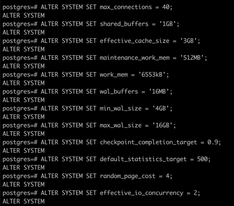
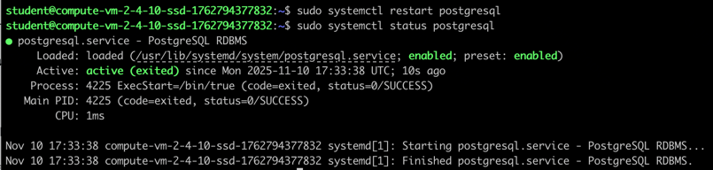

**Результат:**

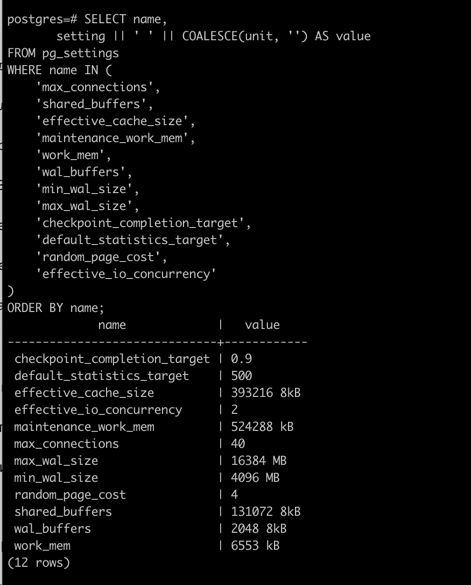

### 7. Повторный запуск `pgbench`

**Команда:**

```
pgbench -c8 -P 6 -T 60 -U postgres test
```

**Результат:**

- TPS: **414**

> Незначительное увеличение TPS, поскольку(и как было выяснено в предыдущем домашнем задании) увеличение параметров
> work и shared memory не дает прироста производительности.

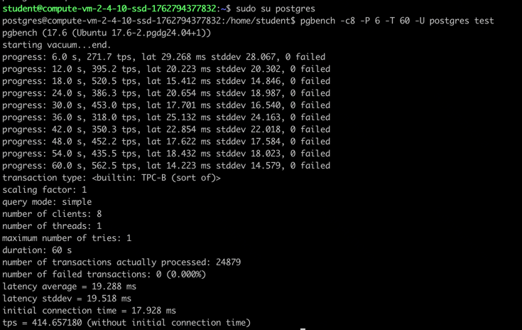

### 8. Создание таблицы и заполнение 1 млн строк

**Команды:**

```sql
CREATE TABLE practice(id serial, text varchar);
INSERT INTO practice(text) SELECT 'test text' FROM generate_series(1,1000000);
SELECT pg_size_pretty(pg_total_relation_size('practice'));
```

**Результат:**

- Размер таблицы: **42 MB**

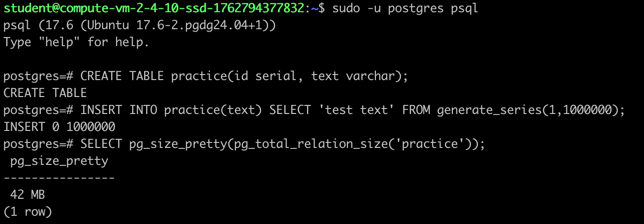

### 9. Обновление данных 5 раз

```sql
UPDATE practice SET text = 'test text 1';
UPDATE practice SET text = 'test text 2';
UPDATE practice SET text = 'test text 3';
UPDATE practice SET text = 'test text 4';
UPDATE practice SET text = 'test text 5';
SELECT pg_size_pretty(pg_total_relation_size('practice'));
```

**Результат:**

- Размер таблицы: **~152 MB**

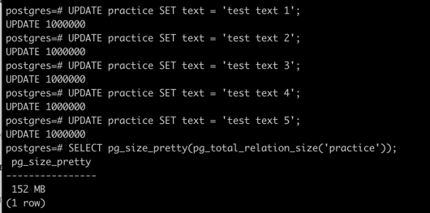

### 10. Проверка мертвых строк и автовакуума

```sql
SELECT relname, n_live_tup, n_dead_tup, trunc(100*n_dead_tup/(n_live_tup+1))::float AS "ratio%", last_autovacuum
FROM pg_stat_user_tables WHERE relname = 'practice';
```

**Результат:**

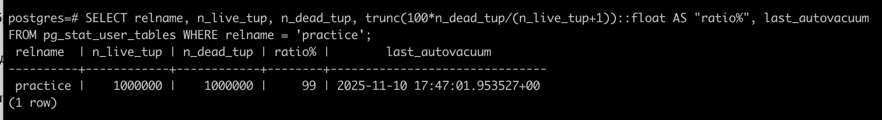

### 11. Анализ страницы данных таблицы

```sql
CREATE EXTENSION IF NOT EXISTS pageinspect;

SELECT
 '(0,' || lp || ')' AS ctid,
 CASE lp_flags
 WHEN 0 THEN 'unused'
 WHEN 1 THEN 'normal'
 WHEN 2 THEN 'redirect to ' || lp_off
 WHEN 3 THEN 'dead'
 END AS state,
 t_xmin as xmin,
 t_xmax as xmax,
 (t_infomask & 256) > 0 AS xmin_committed,
 (t_infomask & 512) > 0 AS xmin_aborted,
 (t_infomask & 1024) > 0 AS xmax_committed,
 (t_infomask & 2048) > 0 AS xmax_aborted, t_ctid
FROM heap_page_items(get_raw_page('practice', 0));

SELECT lp as tuple, t_xmin, t_xmax, t_field3 as t_cid, t_ctid FROM
heap_page_items(get_raw_page('practice', 0));
```

**Результат:**

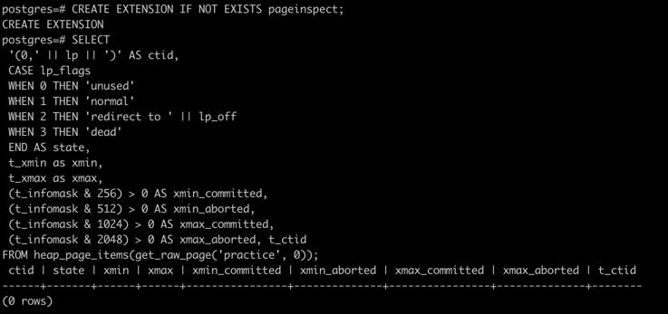

### 12. Ожидание автовакуума

**Результат:**

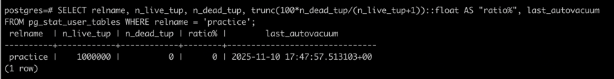

### 13. Обновление данных ещё 5 раз

```sql
UPDATE practice SET text = 'test text 1!';
UPDATE practice SET text = 'test text 2!';
UPDATE practice SET text = 'test text 3!';
UPDATE practice SET text = 'test text 4!';
UPDATE practice SET text = 'test text 5!';
SELECT pg_size_pretty(pg_total_relation_size('practice'));
```

**Результат:**

- Размер таблицы: **149 MB**

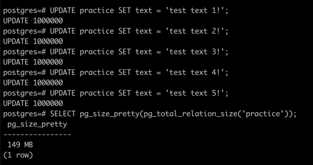

### 14. Отключение автовакуума

```sql
ALTER TABLE practice SET (autovacuum_enabled = false);

SELECT relname, reloptions
FROM pg_class
WHERE relname = 'practice';
```

**Результат:**

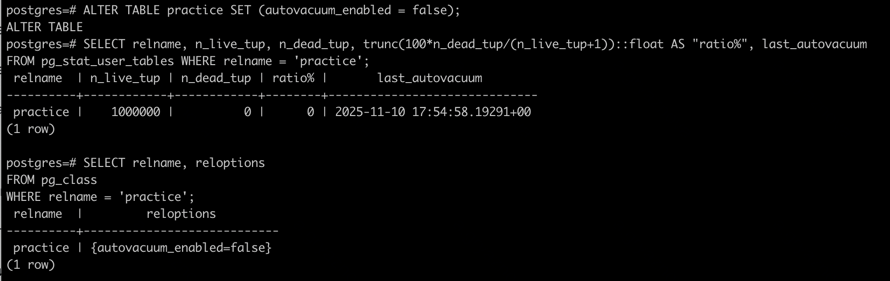

### 15. Обновление данных 10 раз (автовакуум отключен)

```sql
UPDATE practice SET text = 'test text 1!!';
UPDATE practice SET text = 'test text 2!!';
...
UPDATE practice SET text = 'test text 10!!';
SELECT pg_size_pretty(pg_total_relation_size('practice'));
```

**Результат:**

- Размер таблицы: **547 MB**

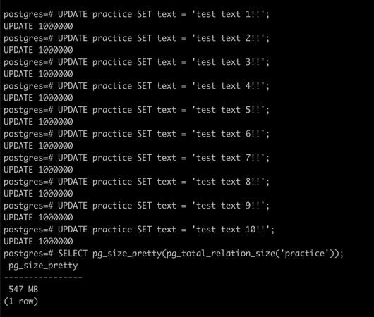

### 16. Проверка мертвых строк и автовакуума

**Результат:**

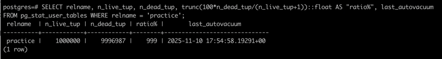

### 17. Включение автовакуума

```sql
ALTER TABLE practice SET (autovacuum_enabled = true);
```

**Результат:**

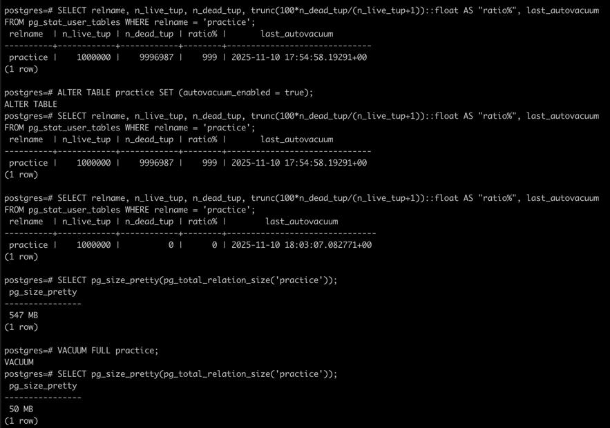
- Размер таблицы: **50 MB**

### Вывод

- После многократного обновления строк с отключенным автовакуумом, размер таблицы значительно увеличился (до 547 МБ),
  из-за накопления устаревших версий строк (dead tuples).
- После повторного включения автовакуума, размер таблицы снизился почти до ее первоначального значения.
  данных.
