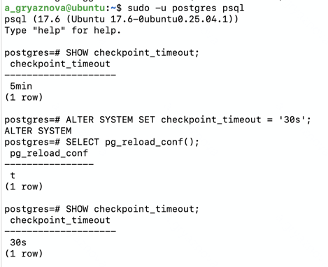
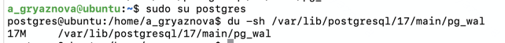
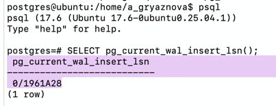
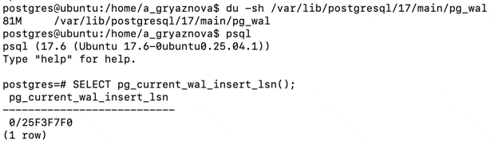
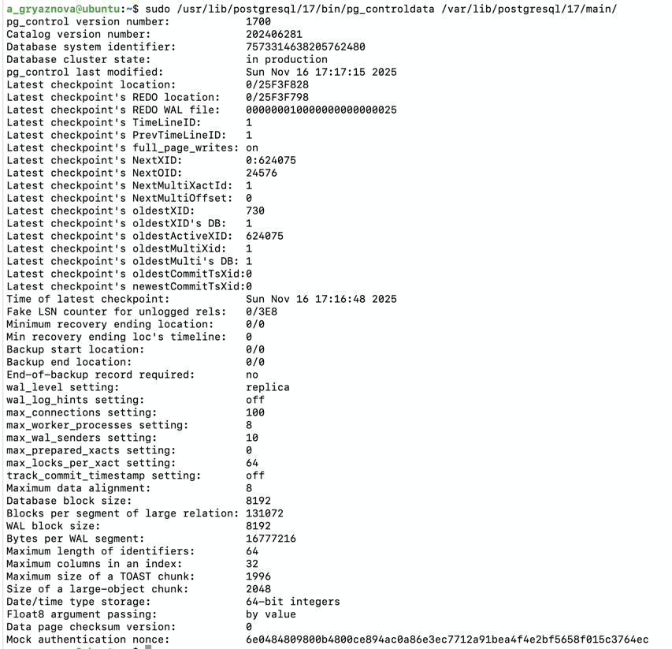
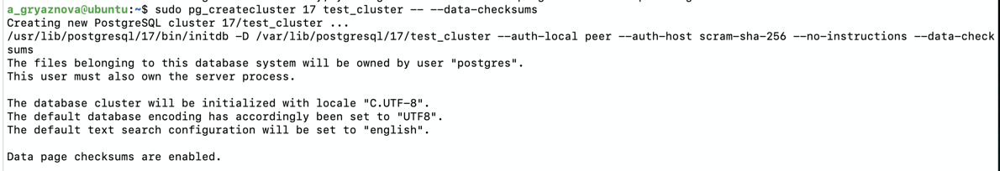
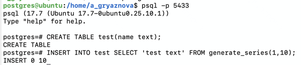
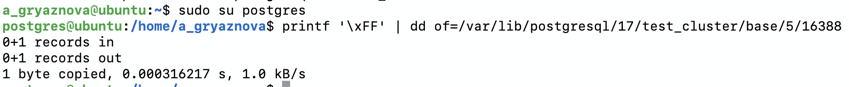

### 1. Настройте выполнение контрольной точки раз в 30 секунд.

```sql
sudo -u postgres psql
SHOW checkpoint_timeout;
ALTER SYSTEM SET checkpoint_timeout = '30s';
SELECT pg_reload_conf();
SHOW checkpoint_timeout;
```

**Результат:**



### 2. 10 минут c помощью утилиты pgbench подавайте нагрузку.

```
sudo su postgres
du -sh /var/lib/postgresql/17/main/pg_wal -- объем перед началом нагрузки

a_gryaznova@ubuntu:~$ sudo du -sh /var/lib/postgresql/17/main/pg_wal
80M     /var/lib/postgresql/17/main/pg_wal
```

**Результат:** 17Mb



```
sudo -u postgres
SELECT pg_current_wal_insert_lsn(); -- первая контрольная точка
```

**Результат:** 0/1961A28



```
sudo su postgres
pgbench -i test
pgbench -c8 -P 6 -T 600 -U postgres test
```

### 3. Измерьте, какой объем журнальных файлов был сгенерирован за это время. Оцените, какой объем приходится в среднем на одну контрольную точку.

```
du -sh /var/lib/postgresql/17/main/pg_wal
```

**Результат:** 18 Mb

```
sudo -u postgres psql
SELECT pg_current_wal_insert_lsn(); -- вторая контрольная точка
```



### 4. Проверьте данные статистики: все ли контрольные точки выполнялись точно по расписанию. Почему так произошло?

```
sudo /usr/lib/postgresql/17/bin/pg_controldata /var/lib/postgresql/17/main/
```



sudo /usr/lib/postgresql/17/bin/pg_waldump -p /var/lib/postgresql/17/main/pg_wal -s 0/25F3FA90 -e 0/4B4B0F88

| num_timed | num_requested | restartpoints_timed | restartpoints_req | restartpoints_done | write_time | sync_time | buffers_written | stats_reset                |
|-----------|---------------|---------------------|-------------------|--------------------|------------|-----------|-----------------|----------------------------| 
| 74        | 0             | 0                   | 0                 | 0                  | 597076     | 620       | 46511           | 2025-11-16 16:28:41.854004 | 

checkpoint запускается не только по времени, но и когда переполняется буфер грязных страниц. Во время нагрузки pgbench
сервер генерирует много изменений, инициируются внеплановые checkpoints

### 5. Сравните tps в синхронном/асинхронном режиме утилитой pgbench. Объясните полученный результат.

В синхронном режиме(synchronous_commit=on)

````
postgres@ubuntu:/home/a_gryaznova$ pgbench -c8 -P 6 -T 600 -U postgres test
pgbench (17.6 (Ubuntu 17.6-0ubuntu0.25.04.1))
starting vacuum...end.
progress: 6.0 s, 976.1 tps, lat 8.142 ms stddev 6.197, 0 failed
...
tps = 1053.281863 (without initial connection time)
````
tps = 1053

В асинхронном режиме(synchronous_commit=on)

````
ALTER SYSTEM SET synchronous_commit = 'off';
SELECT pg_reload_conf();
````

````
postgres@ubuntu:/home/a_gryaznova$ pgbench -c8 -P 6 -T 600 -U postgres test
pgbench (17.6 (Ubuntu 17.6-0ubuntu0.25.04.1))
starting vacuum...end.
progress: 6.0 s, 7052.0 tps, lat 1.129 ms stddev 0.678, 0 failed
...
tps = 7828.491621 (without initial connection time)
````
tps = 7828

Асинхронный режим работает быстрее, так как не ждёт физической записи WAL на диск.


### 6. Создайте новый кластер с включенной контрольной суммой страниц.

```
sudo mkdir /etc/postgresql/17/test_cluster
sudo mkdir /var/lib/postgresql/17/test_cluster
pg_createcluster 17 test_cluster -- --data-checksums
pg_ctlcluster 17 test_cluster start
```




1. Создать таблицу. Вставить несколько значений.

```
CREATE TABLE test(name text);
INSERT INTO test SELECT 'test text' FROM generate_series(1,10);
```



2. Узнать местонахождение таблицы

```
postgres=# SELECT relfilenode FROM pg_class WHERE relname = 'test';
relfilenode
-------------
       16388
```

OID базы данных:
```
postgres=# SELECT oid, datname FROM pg_database;
 oid |  datname
-----+-----------
   5 | postgres
```

Тогда файл таблицы будет: /var/lib/postgresql/17/test_cluster/base/5/16388


3. Выключить кластер. Изменить пару байт в таблице.

```
sudo su postgres
pg_ctlcluster 17 test_cluster stop
```

```
printf '\xFF' | dd of=/var/lib/postgresql/17/test_cluster/base/5/16388 bs=1 seek=500 count=1 conv=notrunc
```



4. Включить кластер и сделать выборку из таблицы.

```
postgres=# select * from test;
ERROR:  invalid page in block 0 of relation "base/5/16388"
```

**Что и почему произошло? как проигнорировать ошибку и продолжить работу?**

PostgreSQL рассчитывает контрольную сумму на всю страницу 8 KB. Если вы поменяли любой байт, хэш уже не совпадёт.

Для продолжения работы можно установить флаг ignore_checksum_failure = on.
```
ALTER SYSTEM SET ignore_checksum_failure = on;
```
