### Выполнение домашней работы:

1. **Настройте сервер так, чтобы в журнал сообщений сбрасывалась информация о блокировках, удерживаемых более 200
   миллисекунд.**

```
ALTER SYSTEM SET log_lock_waits = on;
ALTER SYSTEM SET deadlock_timeout = 200ms;
SELECT pg_reload_conf();
```

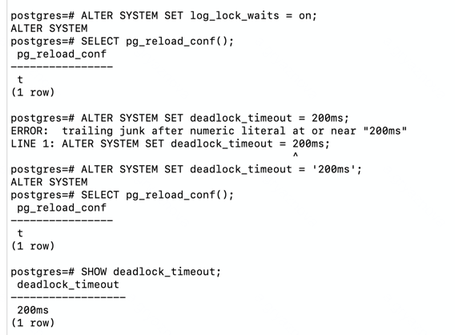

```
CREATE DATABASE locks;
\c locks

CREATE TABLE accounts(
  acc_no integer PRIMARY KEY,
  amount numeric
);

INSERT INTO accounts VALUES(1, 100.00), (2, 200.00), (3, 300.00);
```

Воспроизведите ситуацию, при которой в журнале появятся такие сообщения.

```
-- 1 сессия
BEGIN;
UPDATE accounts SET amount = amount - 100 WHERE acc_no = 1;
```

```
-- 2 сессия
BEGIN;
UPDATE accounts SET amount = amount + 100 WHERE acc_no = 1;
```

После секунды ожидания можно завершить обе транзакции:

```
COMMIT;
```

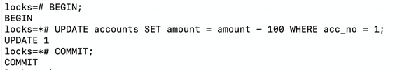

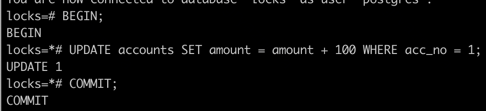

Проверка журнала

```
sudo tail -n 20 /var/log/postgresql/postgresql-17-main.log
```

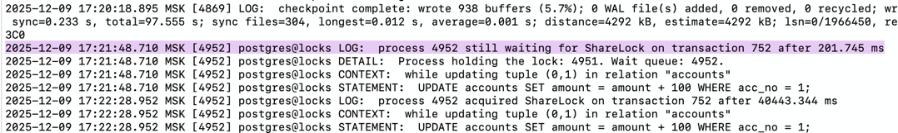

2. **Смоделируйте ситуацию обновления одной и той же строки тремя командами UPDATE в разных сеансах. Изучите возникшие
   блокировки в представлении pg_locks и убедитесь, что все они понятны. Пришлите список блокировок и объясните, что
   значит каждая.**

```
-- 1 сессия
\c locks
BEGIN;
SELECT pg_backend_pid();
UPDATE accounts SET amount = amount + 1 WHERE acc_no = 1;
```

**pid = 5191**

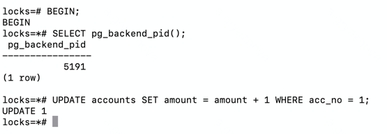

```
-- 2 сессия
\c locks
BEGIN;
SELECT pg_backend_pid();
UPDATE accounts SET amount = amount + 1 WHERE acc_no = 1;
```

**pid = 5202**

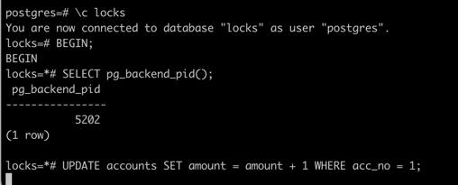

```
-- 3 сессия
\c locks
BEGIN;
SELECT pg_backend_pid();
UPDATE accounts SET amount = amount + 1 WHERE acc_no = 1;
```

**pid = 5205**


Информация о блокировках

```
SELECT locktype, mode, granted, pid, pg_blocking_pids(pid) AS wait_for 
FROM pg_locks 
WHERE relation = 'accounts'::regclass;
```

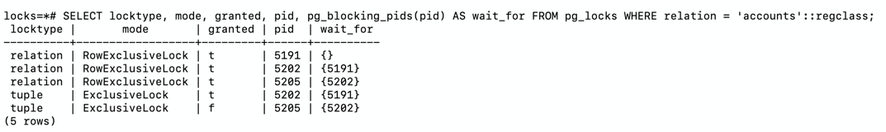

Первая транзакция удерживает блокировку типа relation в режиме RowExclusiveLock.
Вторая транзакция удерживает блокировку типа relation в режиме RowExclusiveLock и блокировку типа tuple в режиме
ExclusiveLock и ожидает заверщения первой транзакции.
Третья транзакция также удерживает блокировку типа relation в режиме RowExclusiveLock и блокировку типа tuple в режиме
ExclusiveLock и ожидает заверщения второй транзакции.

3. **Воспроизведите взаимоблокировку трех транзакций. Можно ли разобраться в ситуации постфактум, изучая журнал
   сообщений?**

```
-- 1 сессия
\c locks
BEGIN;
UPDATE accounts SET amount = amount + 1 WHERE acc_no = 1;
```

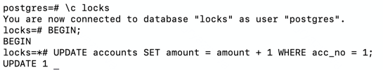

```
-- 2 сессия
\c locks
BEGIN;
UPDATE accounts SET amount = amount + 1 WHERE acc_no = 2;
```

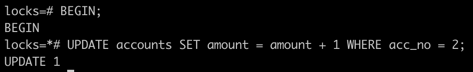

```
-- 3 сессия
\c locks
BEGIN;
UPDATE accounts SET amount = amount + 1 WHERE acc_no = 3;
```

Зациклим три транзакции:

```
-- 1 сессия
UPDATE accounts SET amount = amount + 1 WHERE acc_no = 2;
```

```
-- 2 сессия
UPDATE accounts SET amount = amount + 1 WHERE acc_no = 3;
```

```
-- 3 сессия
UPDATE accounts SET amount = amount + 1 WHERE acc_no = 1;
```

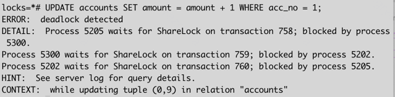

Postgres логирует цепочку ожиданий.
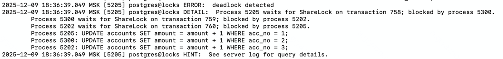

4. **Могут ли две транзакции, выполняющие единственную команду UPDATE одной и той же таблицы (без where), заблокировать
   друг друга?**

Нет, взаимоблокировки не будет. Команда

```
UPDATE accounts SET amount = amount + 1;
```

всегда обновляет строки в порядке ctid. Таким образом обе транзакции пытаются обновлять строки в одном и том же порядке
первая, кто дошёл до обновления строки, заблокирует её вторая встанет в очередь и не пойдёт дальше. Получится
последовательное ожидание, но не цикл, следовательно, deadlock невозможен.

```
-- 1 сессия
BEGIN;
UPDATE accounts SET amount = amount + 1;
```
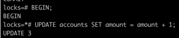
```
-- 2 сессия
BEGIN;
UPDATE accounts SET amount = amount - 1;
```
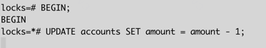
```
SELECT locktype, mode, granted, pid, pg_blocking_pids(pid) AS wait_for 
FROM pg_locks 
WHERE relation = 'accounts'::regclass;
```
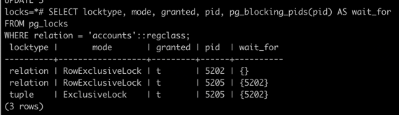

Вторая транзакция ждет освобождения первой, но взаимоблокировки не происходит.
