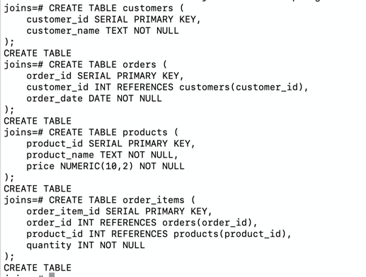
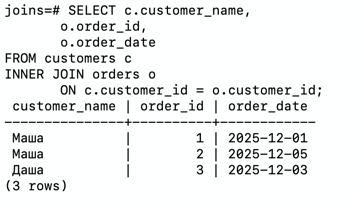
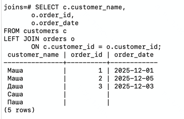
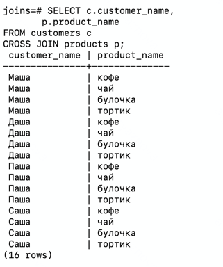
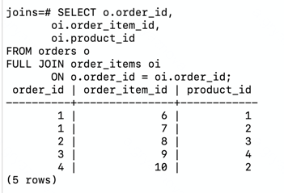
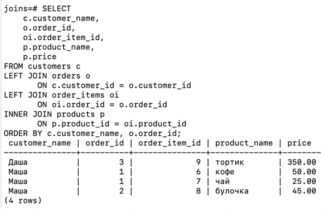
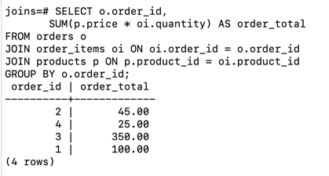
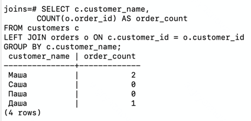
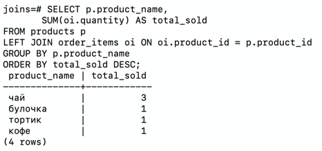

### Выполнение домашней работы:

1. Реализовать прямое соединение двух или более таблиц
2. Реализовать левостороннее (или правостороннее) соединение двух или более таблиц
3. Реализовать кросс соединение двух или более таблиц
4. Реализовать полное соединение двух или более таблиц
5. Реализовать запрос, в котором будут использованы разные типы соединений
6. Сделать комментарии на каждый запрос
7. К работе приложить структуру таблиц, для которых выполнялись соединения

### 1. Структура таблиц

```sql
CREATE TABLE customers (
    customer_id SERIAL PRIMARY KEY,
    customer_name TEXT NOT NULL
);

CREATE TABLE orders (
    order_id SERIAL PRIMARY KEY,
    customer_id INT REFERENCES customers(customer_id),
    order_date DATE NOT NULL
);

CREATE TABLE products (
    product_id SERIAL PRIMARY KEY,
    product_name TEXT NOT NULL,
    price NUMERIC(10,2) NOT NULL
);

CREATE TABLE order_items (
    order_item_id SERIAL PRIMARY KEY,
    order_id INT REFERENCES orders(order_id),
    product_id INT REFERENCES products(product_id),
    quantity INT NOT NULL
);
```



### 2. Наполнение таблиц

```sql
INSERT INTO customers (customer_name) VALUES
('Маша'), ('Даша'), ('Паша'), ('Саша');

INSERT INTO orders (customer_id, order_date) VALUES
(1, '2025-12-01'), (1, '2025-12-05'), (2, '2025-12-03'), (NULL, '2025-12-07');

INSERT INTO products (product_name, price) VALUES
('кофе', 50), ('чай', 25), ('булочка', 45), ('тортик', 350);

INSERT INTO order_items (order_id, product_id, quantity) VALUES
(1, 1, 1), (1, 2, 2), (2, 3, 1), (3, 4, 1), (4, 2, 1);
```


### 3. Прямое соединение двух или более таблиц

Вывести покупателей и их заказы. INNER JOIN возвращает только тех клиентов, у которых есть заказы.

```sql
SELECT c.customer_name,
       o.order_id,
       o.order_date
FROM customers c
INNER JOIN orders o
       ON c.customer_id = o.customer_id;
```



### 4. Левостороннее соединение двух или более таблиц

Показать всех клиентов и, если есть, их заказы. LEFT JOIN возвращает всех клиентов, включая тех, у которых нет заказов.

```sql
SELECT c.customer_name,
       o.order_id,
       o.order_date
FROM customers c
LEFT JOIN orders o
       ON c.customer_id = o.customer_id;
```



### 5. Кросс соединение двух или более таблиц

Вывести все возможные комбинации покупателей и товаров. CROSS JOIN возвращает все возможные комбинации строк из двух
таблиц.

```sql
SELECT c.customer_name,
       p.product_name
FROM customers c
CROSS JOIN products p;
```



### 6. Полное соединение двух или более таблиц

Вывести всех клиентов и их заказы, включая тех, у которых нет заказов и тех, у которых нет клиентов. FULL JOIN
возвращает все строки из обеих таблиц, включая те, которые не имеют соответствий.

```sql
SELECT o.order_id,
       oi.order_item_id,
       oi.product_id
FROM orders o
FULL JOIN order_items oi
       ON o.order_id = oi.order_id;
```



### 7. Запрос, в котором будут использованы разные типы соединений

Показываем клиентов, у которых есть заказы. Показываем все товары и цену в заказах.

```sql
SELECT 
    c.customer_name,
    o.order_id,
    oi.order_item_id,
    p.product_name,
    p.price
FROM customers c
LEFT JOIN orders o
       ON c.customer_id = o.customer_id
LEFT JOIN order_items oi
       ON oi.order_id = o.order_id     
INNER JOIN products p
       ON p.product_id = oi.product_id 
ORDER BY c.customer_name, o.order_id;
```



### 8. 3 своих метрики на основе показанных представлений

**Метрика 1: Средний чек заказа**

```sql
SELECT o.order_id,
       SUM(p.price * oi.quantity) AS order_total
FROM orders o
JOIN order_items oi ON oi.order_id = o.order_id
JOIN products p ON p.product_id = oi.product_id
GROUP BY o.order_id;
```



**Метрика 2: Количество заказов по каждому клиенту**

```sql
SELECT c.customer_name,
       COUNT(o.order_id) AS order_count
FROM customers c
LEFT JOIN orders o ON c.customer_id = o.customer_id
GROUP BY c.customer_name;
```



**Метрика 3: ТОП-товары по популярности**

```sql
SELECT p.product_name,
       SUM(oi.quantity) AS total_sold
FROM products p
LEFT JOIN order_items oi ON oi.product_id = p.product_id
GROUP BY p.product_name
ORDER BY total_sold DESC;
```


