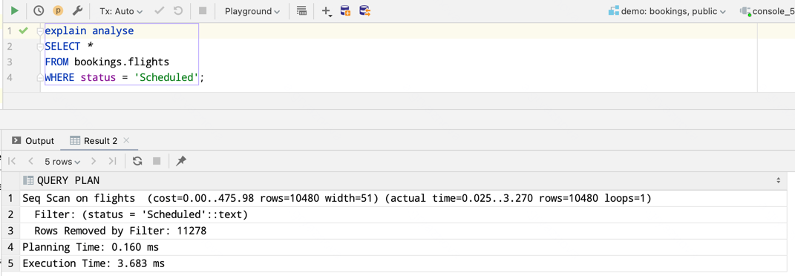
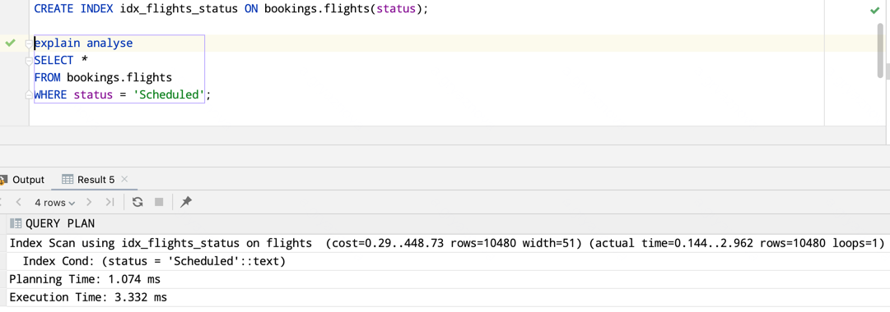
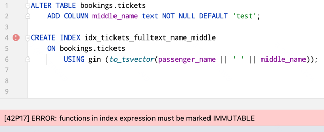
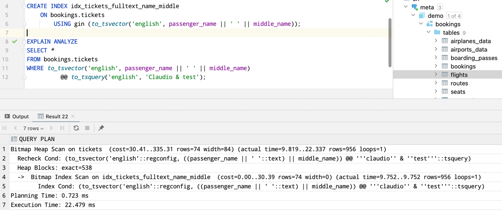
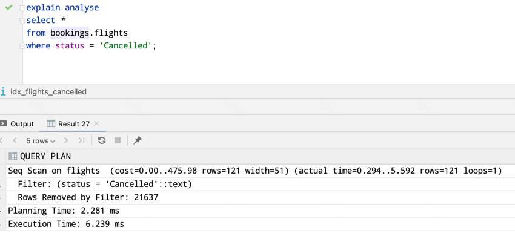
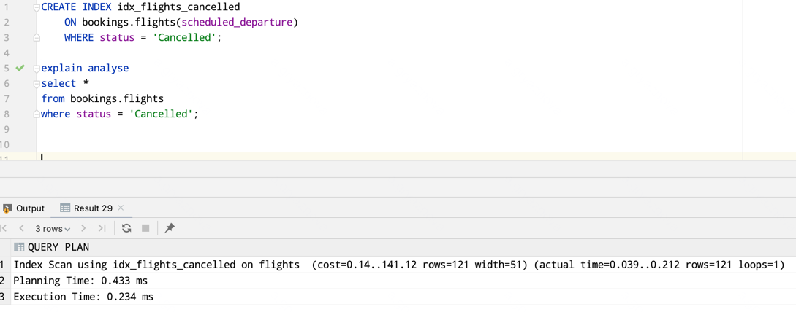
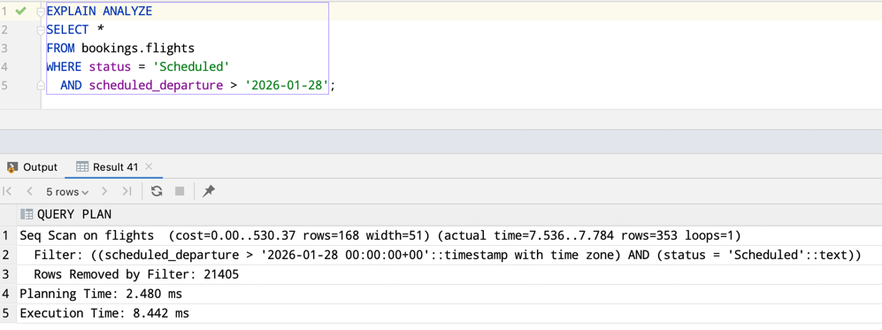
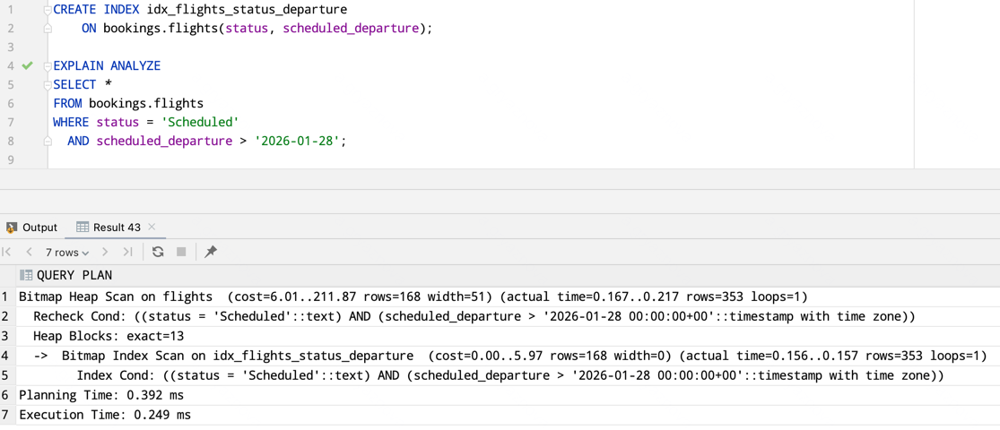

### Выполнение домашней работы:

1. Создать индекс к какой-либо из таблиц вашей БД
2. Прислать текстом результат команды explain, в которой используется данный индекс
3. Реализовать индекс для полнотекстового поиска
4. Реализовать индекс на часть таблицы или индекс на поле с функцией
5. Создать индекс на несколько полей
6. Написать комментарии к каждому из индексов

### 1. Создать индекс к какой-либо из таблиц вашей БД

В качестве учебной базы возьмем демонстрационную базу Postgres Pro.
Создадим индекс к таблице flights.

До индекса:


Создадим индекс:

```sql
CREATE INDEX idx_flights_status ON bookings.flights(status);
```

После индекса:


### 2. Прислать текстом результат команды explain, в которой используется данный индекс

```
Index Scan using idx_flights_status on flights  (cost=0.29..448.73 rows=10480 width=51) (actual time=0.144..2.962
rows=10480 loops=1)
Index Cond: (status = 'Scheduled'::text)
Planning Time: 1.074 ms
Execution Time: 3.332 ms
```

### 3. Реализовать индекс для полнотекстового поиска

Добавим колонку middle_name, чтобы создать индекс на две поля.

```sql
ALTER TABLE bookings.tickets
    ADD COLUMN middle_name text NOT NULL DEFAULT 'test';
```

При попытке создать индекс

```sql
CREATE INDEX idx_tickets_fulltext_name_middle
    ON bookings.tickets
        USING gin (to_tsvector(passenger_name || ' ' || middle_name));
```



PostgreSQL запрещает использовать в индексах функции, результат которых может изменяться без изменения входных
параметров.

Функция to_tsvector(text) зависит от настройки сервера (default_text_search_config), поэтому не считается IMMUTABLE.

После явного указания конфигурации to_tsvector('english', text) функция становится детерминированной и может
использоваться в индексе.

Исправим индекс:

```sql
CREATE INDEX idx_tickets_fulltext_name_middle
    ON bookings.tickets
        USING gin (to_tsvector('english', passenger_name || ' ' || middle_name));
```



Вывод команды explain:

```
Bitmap Heap Scan on tickets  (cost=30.41..335.31 rows=74 width=84) (actual time=9.819..22.337 rows=956 loops=1)
"  Recheck Cond: (to_tsvector('english'::regconfig, ((passenger_name || ' '::text) || middle_name)) @@ '''claudio'' & ''test'''::tsquery)"
  Heap Blocks: exact=538
  ->  Bitmap Index Scan on idx_tickets_fulltext_name_middle  (cost=0.00..30.39 rows=74 width=0) (actual time=9.752..9.752 rows=956 loops=1)
"        Index Cond: (to_tsvector('english'::regconfig, ((passenger_name || ' '::text) || middle_name)) @@ '''claudio'' & ''test'''::tsquery)"
Planning Time: 0.723 ms
Execution Time: 22.479 ms
```

### 4. Реализовать индекс на часть таблицы или индекс на поле с функцией

Создадим индекc на полеты, которые отменили.

До индекса:


```
Seq Scan on flights  (cost=0.00..475.98 rows=121 width=51) (actual time=0.294..5.592 rows=121 loops=1)
  Filter: (status = 'Cancelled'::text)
  Rows Removed by Filter: 21637
Planning Time: 2.281 ms
Execution Time: 6.239 ms
```

Создаем индекс:

```sql
CREATE INDEX idx_flights_cancelled
    ON bookings.flights(scheduled_departure)
    WHERE status = 'Cancelled';
```

После индекса:



```
Index Scan using idx_flights_cancelled on flights  (cost=0.14..141.12 rows=121 width=51) (actual time=0.039..0.212 rows=121 loops=1)
Planning Time: 0.433 ms
Execution Time: 0.234 ms
```

### 5. Создать индекс на несколько полей

До индекса:



```sql
CREATE INDEX idx_flights_status_departure
ON bookings.flights(status, scheduled_departure);
```

После индекса:


```
Bitmap Heap Scan on flights  (cost=6.01..211.87 rows=168 width=51) (actual time=0.167..0.217 rows=353 loops=1)
  Recheck Cond: ((status = 'Scheduled'::text) AND (scheduled_departure > '2026-01-28 00:00:00+00'::timestamp with time zone))
  Heap Blocks: exact=13
  ->  Bitmap Index Scan on idx_flights_status_departure  (cost=0.00..5.97 rows=168 width=0) (actual time=0.156..0.157 rows=353 loops=1)
        Index Cond: ((status = 'Scheduled'::text) AND (scheduled_departure > '2026-01-28 00:00:00+00'::timestamp with time zone))
Planning Time: 0.392 ms
Execution Time: 0.249 ms
```

### 6. Написать комментарии к каждому из индексов

```sql
COMMENT ON INDEX idx_flights_status IS 'Ускоряет поиск рейсов по статусу';

COMMENT ON INDEX idx_flights_status_departure IS 'Составной индекс для поиска рейсов по статусу и дате вылета';

COMMENT ON INDEX idx_flights_cancelled IS 'Частичный индекс для отменённых рейсов';

COMMENT ON INDEX idx_tickets_fulltext_name_middle IS 'GIN индекс для полнотекстового поиска пассажиров';
```
