# Создание и тестирование высоконагруженного отказоустойчивого кластера PostgreSQL на базе Patroni

Вот как будет выглядеть ваша инструкция в стиле отчета:

## 1. Создание виртуальных машин в OrbStack

Для реализации отказоустойчивого кластера были созданы три виртуальные машины, на которых планировалась установка
компонентов кластера.

## 2. Установка и настройка etcd

### 2.1. Установка etcd

На каждой виртуальной машине была произведена установка etcd:

```bash
sudo apt update
sudo apt -y install etcd-server
sudo apt -y install etcd-client
sudo systemctl stop etcd
sudo systemctl disable etcd
sudo rm -rf /var/lib/etcd/default 
```

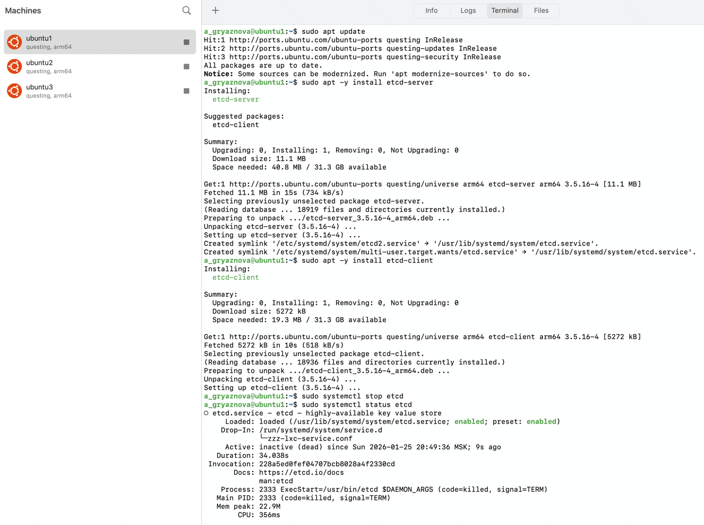

### 2.2. Конфигурирование etcd

Для корректной работы кластера etcd были выполнены следующие настройки на каждой ноде:

#### Первая виртуальная машина

Файл `/etc/default/etcd` был настроен следующим образом:

```
ETCD_NAME="etcd1"
ETCD_DATA_DIR="/var/lib/etcd"
ETCD_LISTEN_PEER_URLS="http://0.0.0.0:2380"
ETCD_LISTEN_CLIENT_URLS="http://0.0.0.0:2379"
ETCD_INITIAL_ADVERTISE_PEER_URLS="http://192.168.139.129:2380"
ETCD_ADVERTISE_CLIENT_URLS="http://192.168.139.129:2379"
ETCD_INITIAL_CLUSTER="etcd1=http://192.168.139.129:2380,etcd2=http://192.168.139.142:2380,etcd3=http://192.168.139.90:2380"
ETCD_INITIAL_CLUSTER_STATE="new"
ETCD_INITIAL_CLUSTER_TOKEN="etcd-cluster-patroni"
ETCD_ELECTION_TIMEOUT="10000"
ETCD_HEARTBEAT_INTERVAL="2000"
ETCD_INITIAL_ELECTION_TICK_ADVANCE="false"
ETCD_ENABLE_V2="true"
```


При попытке запуска etcd служба зависла в состоянии ожидания кворума.


#### Вторая виртуальная машина

Конфигурация для второй ноды:

```
ETCD_NAME="etcd2"
ETCD_DATA_DIR="/var/lib/etcd"
ETCD_LISTEN_PEER_URLS="http://0.0.0.0:2380"
ETCD_LISTEN_CLIENT_URLS="http://0.0.0.0:2379"
ETCD_INITIAL_ADVERTISE_PEER_URLS="http://192.168.139.142:2380"
ETCD_ADVERTISE_CLIENT_URLS="http://192.168.139.142:2379"
...
```


После запуска наблюдалось ожидание кворума.


#### Третья виртуальная машина

Конфигурация для третьей ноды:

```
ETCD_NAME="etcd3"
ETCD_DATA_DIR="/var/lib/etcd"
ETCD_LISTEN_PEER_URLS="http://0.0.0.0:2380"
ETCD_LISTEN_CLIENT_URLS="http://0.0.0.0:2379"
ETCD_INITIAL_ADVERTISE_PEER_URLS="http://192.168.139.90:2380"
ETCD_ADVERTISE_CLIENT_URLS="http://192.168.139.90:2379"
...
```

После настройки всех узлов кластер etcd успешно запустился и ожидает запросов.

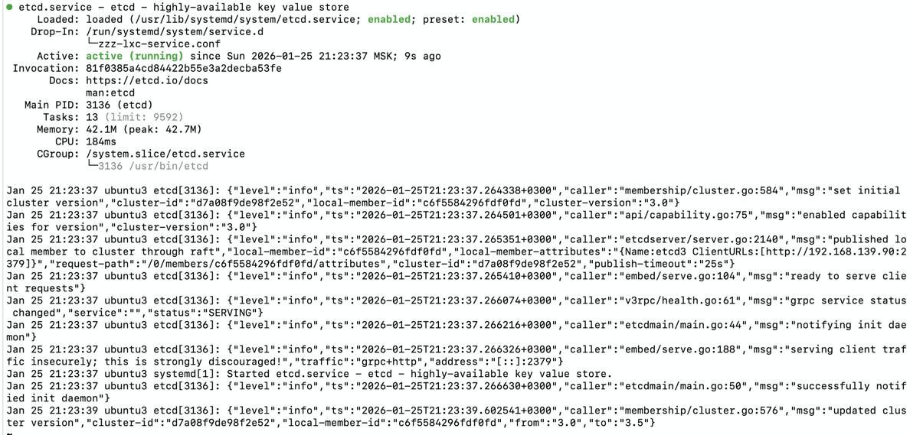

### 2.3. Проверка состояния кластера etcd

Для мониторинга состояния кластера были выполнены команды:

```bash
sudo systemctl status etcd
sudo systemctl stop etcd
sudo systemctl is-enabled etcd
sudo systemctl restart etcd
etcdctl endpoint status --cluster -w table
```


### 2.4. Проверка отказоустойчивости

После отключения etcd на одной из нод кластер продолжил работу

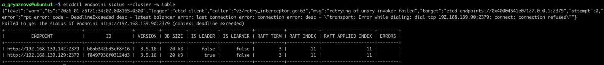

## 3. Установка PostgreSQL

**На все три ноды установлен PostgreSQL:**

```bash
sudo apt install curl ca-certificates
sudo install -d /usr/share/postgresql-common/pgdg
sudo curl -o /usr/share/postgresql-common/pgdg/apt.postgresql.org.asc --fail https://www.postgresql.org/media/keys/ACCC4CF8.asc

. /etc/os-release
sudo sh -c "echo 'deb [signed-by=/usr/share/postgresql-common/pgdg/apt.postgresql.org.asc] https://apt.postgresql.org/pub/repos/apt $VERSION_CODENAME-pgdg main' > /etc/apt/sources.list.d/pgdg.list"

sudo apt update
sudo apt install postgresql-17
```

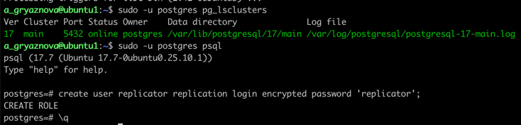

**Создание пользователя replicator и rewind_user:**

```sql
create user replicator replication login encrypted password 'replicator';
create user rewind_user login superuser password 'rewind_user';
```

**Редактирование файла pg_hba.conf:**

```
host all all 0.0.0.0/0 scram-sha-256
host replication replicator 0.0.0.0/0 scram-sha-256
```

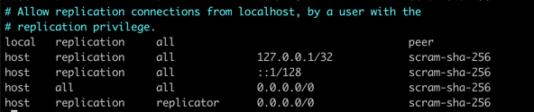

**Редактирование файла postgresql.conf:**

```
listen_address = '*'
```

**Проверка, что кластер запущен на всех трех нодах:**

````
sudo -u postgres pg_lsclusters
````

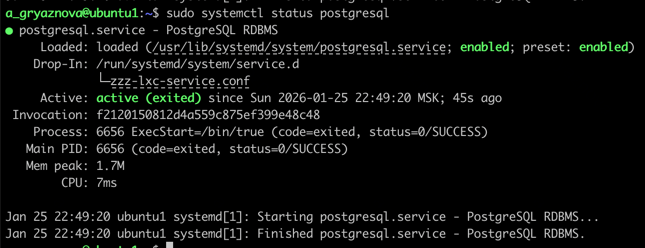

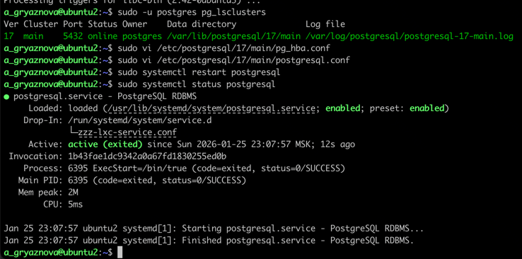

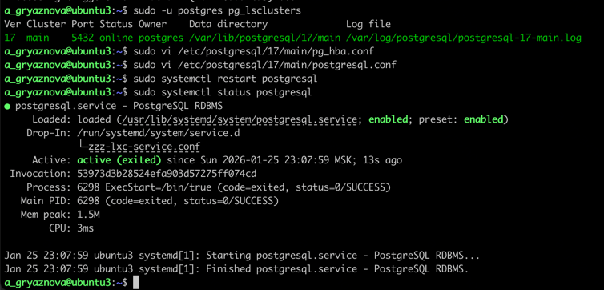

**На второй и третьей ноде удалить содержимое каталога pgdata:**

```bash
sudo systemctl stop postgresql
rm -rf /var/lib/postgresql/17/main/*
```

## 4. Установка и настройка Patroni

### 4.1. Подготовка окружения

Для корректной работы Patroni необходимо установить вспомогательные утилиты и подготовить окружение:

1. **Установка модуля для создания виртуальных окружений:**

```bash
sudo apt install python3-venv
```

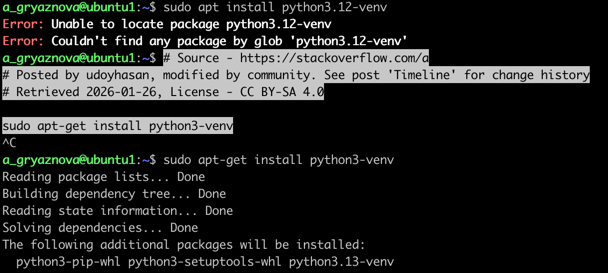

2. **Создание каталога для Patroni:**

```bash
sudo mkdir -p /opt/patroni
```

3. **Назначение владельца каталога:**

```bash
sudo chown postgres:postgres /opt/patroni
```

4. **Создание виртуального окружения от имени пользователя `postgres`:**

```bash
sudo -u postgres python3 -m venv /opt/patroni/venv
```

5. **Установка Patroni с поддержкой etcd3:**

```bash
sudo -u postgres /opt/patroni/venv/bin/pip install 'patroni[etcd3]'
```

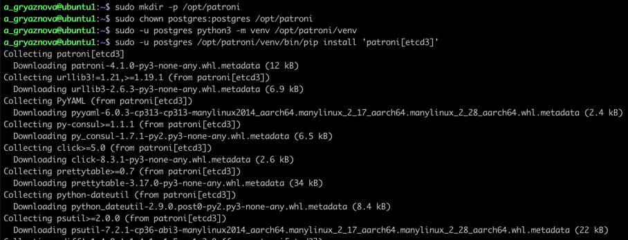

6. **Установка драйвера для взаимодействия с PostgreSQL:**

```bash
sudo -u postgres /opt/patroni/venv/bin/pip install psycopg2-binary
```

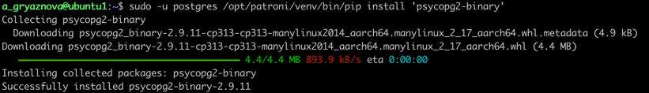

### 4.2. Настройка сервиса Patroni

1. **Создание конфигурационного файла:**

```bash
sudo vi /etc/patroni.yml
```

2. **Создание systemd-юнита:**

```bash
sudo vi /etc/systemd/system/patroni.service
```

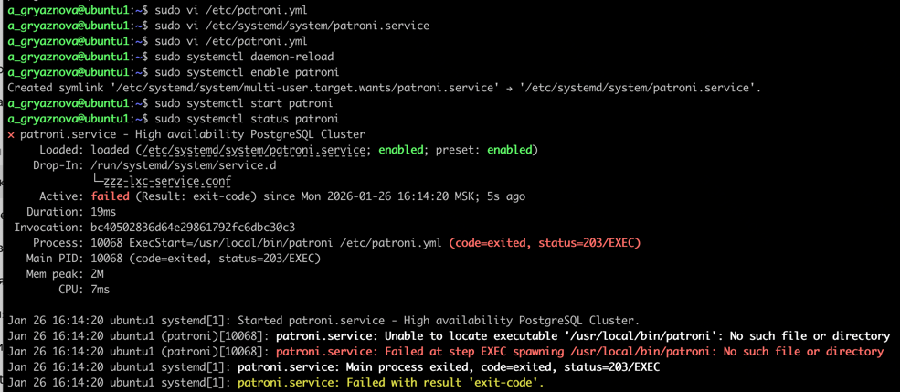

> ⚠️Так как Patroni установлен в виртуальное окружение, необходимо изменить путь в `ExecStart`:

```ini
ExecStart=/usr/local/bin/patroni /etc/patroni.yml
```

заменить на:

```ini
ExecStart=/opt/patroni/venv/bin/patroni /etc/patroni.yml
```

3. **Перезагрузка systemd и запуск сервиса:**

```bash
sudo systemctl daemon-reexec
sudo systemctl daemon-reload
sudo systemctl start patroni
sudo systemctl enable patroni
```

### 4.3. Устранение ошибок запуска

Во время первой попытки запуска была получена ошибка:

```
could not access the server configuration file "/var/lib/postgresql/17/main/postgresql.conf": No such file or directory
```

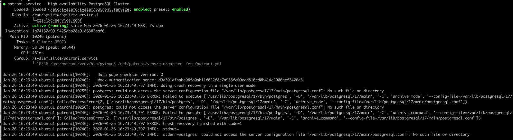

Для исправления произведены следующие действия:

1. **Очистка и пересоздание каталога данных PostgreSQL:**

```bash
sudo systemctl stop postgresql || true
sudo rm -rf /var/lib/postgresql/17/main
sudo mkdir -p /var/lib/postgresql/17/main
sudo chown -R postgres:postgres /var/lib/postgresql/17
sudo chmod 700 /var/lib/postgresql/17/main
```

Первая нода определилась как реплика:

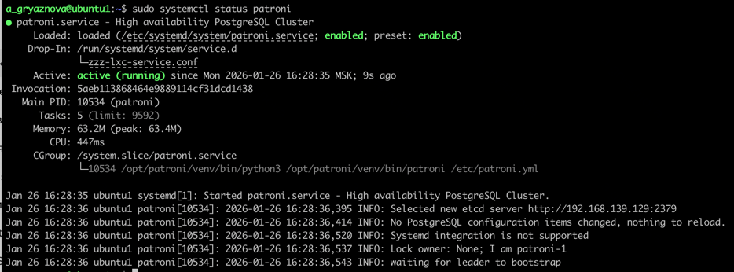

2. **Очистка кластера Patroni в etcd:**

```bash
sudo -u postgres /opt/patroni/venv/bin/patronictl -c /etc/patroni.yml remove postgres-cluster
```

3. **Очистка данных в etcd:**

```bash
ETCDCTL_API=2 etcdctl --endpoints="http://192.168.139.129:2379,http://192.168.139.142:2379,http://192.168.139.90:2379" rm /db --recursive
```

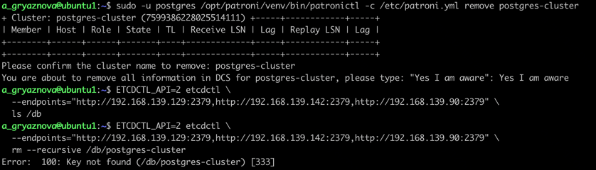

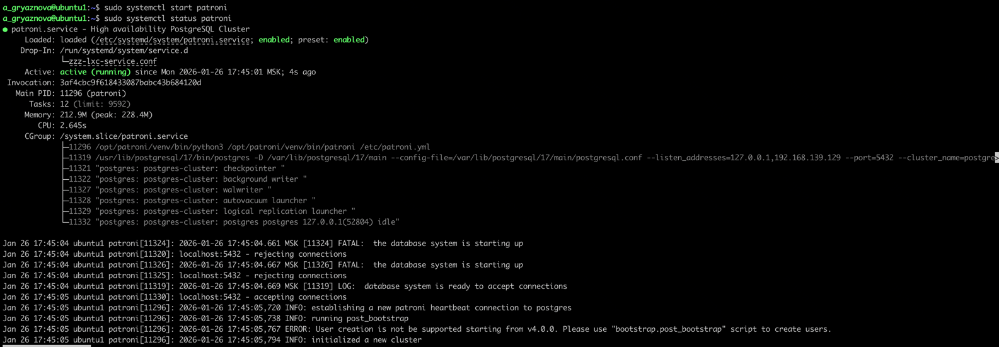

### 4.4. Проверка состояния кластера

1. **Проверка текущего состояния кластера Patroni:**

```bash
sudo -u postgres /opt/patroni/venv/bin/patronictl -c /etc/patroni.yml list
```

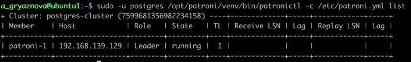

2. **Аналогичные действия выполнены на второй и третьей нодах.**

> ⚠️ На второй и третьей нодах были получены ошибки запуска, связанные с поврежденным состоянием каталогов данных
> PostgreSQL.

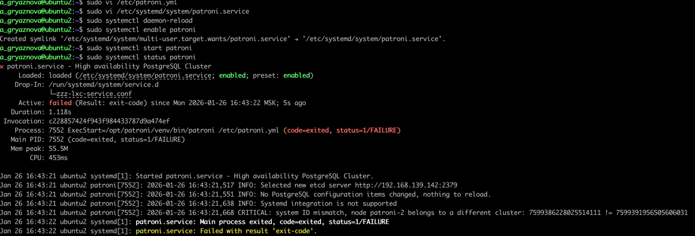

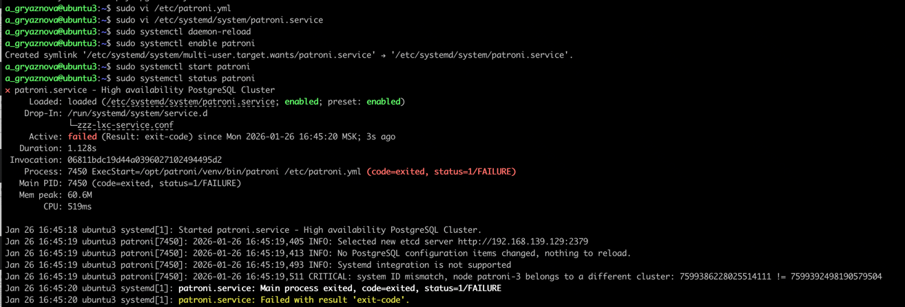

3. **Решение: очистка каталогов и повторный запуск:**

```bash
sudo systemctl stop postgresql || true
sudo rm -rf /var/lib/postgresql/17/main
sudo mkdir -p /var/lib/postgresql/17/main
sudo chown -R postgres:postgres /var/lib/postgresql/17
sudo chmod 700 /var/lib/postgresql/17/main
```

4. **Статусы после восстановления:**

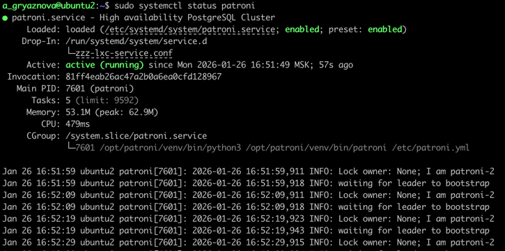

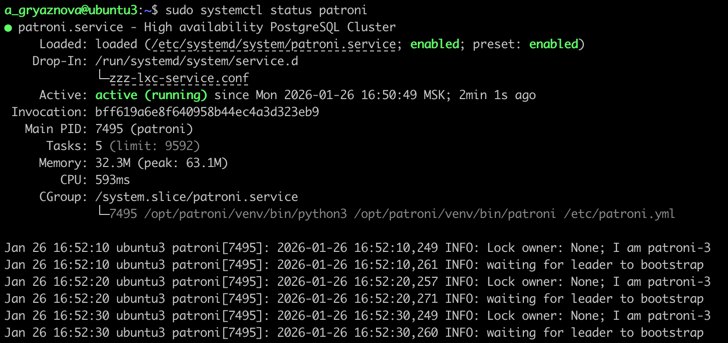

5. **Финальная проверка:**

```bash
sudo -u postgres /opt/patroni/venv/bin/patronictl -c /etc/patroni.yml list
```

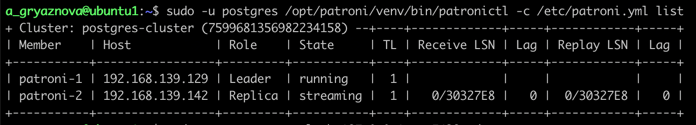

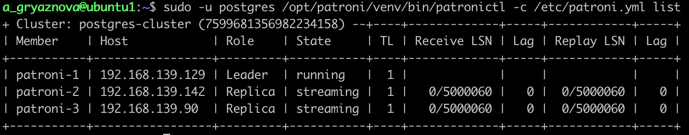

## 5. Загрузка тестовых данных в PostgreSQL

Загрузим тестовые данные в мастер-ноду:

```bash
gunzip -c demo-20250901-3m.sql.gz | psql -h 192.168.139.129 -p 5432 -U postgres -d postgres
```

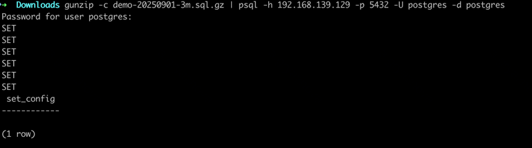

Проверка загрузки:

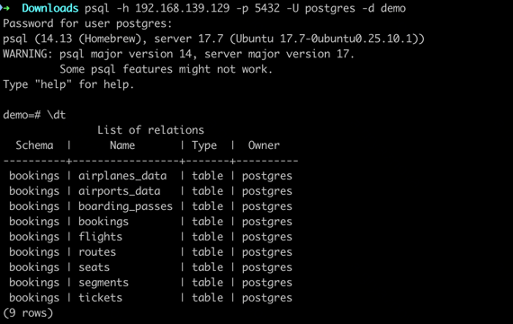

На второй ноде:

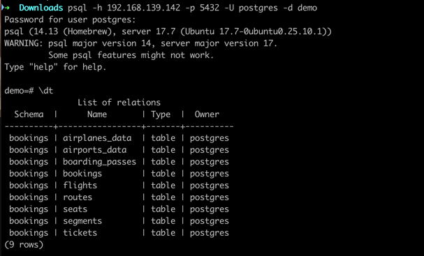

На третьей ноде:

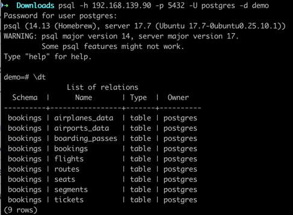

## 6. Тестирование механизма failover

### 6.1. Проверка текущего состояния кластера

Перед началом тестирования был выполнен запрос на отображение текущего состояния кластера:

```bash
sudo -u postgres /opt/patroni/venv/bin/patronictl -c /etc/patroni.yml list
```

Видно, что нода patroni-1 является мастером, а две другие — репликами.

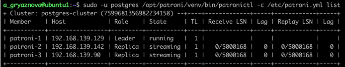

### 6.2. Имитация отказа мастер-ноды

Для тестирования отказоустойчивости было выполнено отключение Patroni:

```bash
sudo systemctl stop patroni
```

### 6.3. Автоматическое переключение (failover)

Через несколько секунд Patroni автоматически определил недоступность мастер-ноды и произвел выбор нового мастера среди
доступных реплик.

Для проверки нового состояния кластера снова был выполнен список нод:

```bash
sudo -u postgres /opt/patroni/venv/bin/patronictl -c /etc/patroni.yml list
```

Новый мастер был успешно выбран.

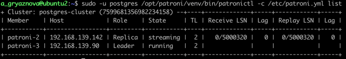

### 6.4. Восстановление бывшей мастер-ноды

После подтверждения успешного failover бывшая мастер-нода была возвращена в строй:

```bash
sudo systemctl start patroni
```

Patroni автоматически определил, что эта нода должна стать репликой нового мастера, и начал процесс синхронизации.

Статус кластера после восстановления:

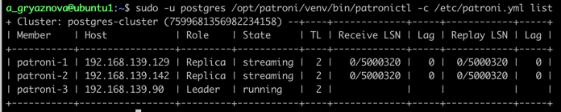

### 6.5. Проверка обратного переключения (manual failover)

Для проверки возможности ручного переключения был выполнен командой `patronictl`:

```bash
sudo -u postgres /opt/patroni/venv/bin/patronictl -c /etc/patroni.yml failover
```

Было выбрано целевое имя ноды, на которую необходимо перенести роль мастера.
И подтвержден успешный переход роли мастера на указанную ноду.

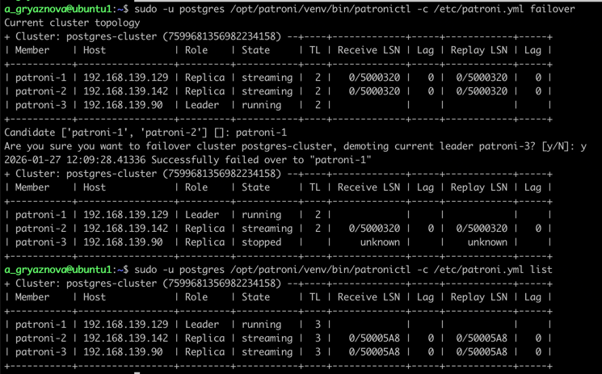

## 6. Установка и настройка HAProxy

### 6.1. Установка HAProxy

На виртуальную машину был установлен HAProxy:

```bash
sudo apt update
sudo apt install haproxy -y
```

Проверка установленной версии:

```bash
haproxy -v
```

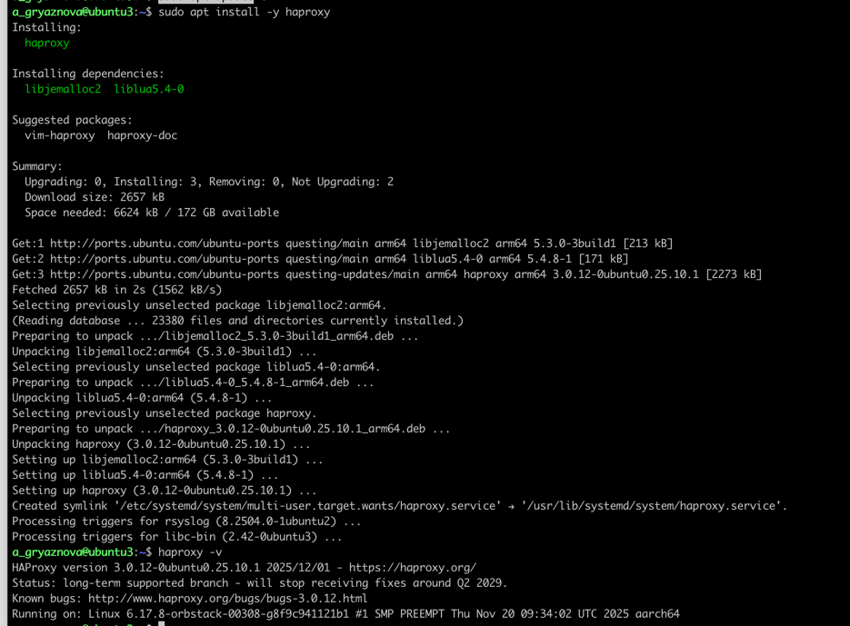

### 6.2. Настройка конфигурации HAProxy

Резервное копирование оригинального конфига:

```bash
sudo cp /etc/haproxy/haproxy.cfg /etc/haproxy/haproxy.cfg.bak
```

Редактирование конфигурационного файла:

```bash
sudo vi /etc/haproxy/haproxy.cfg
```

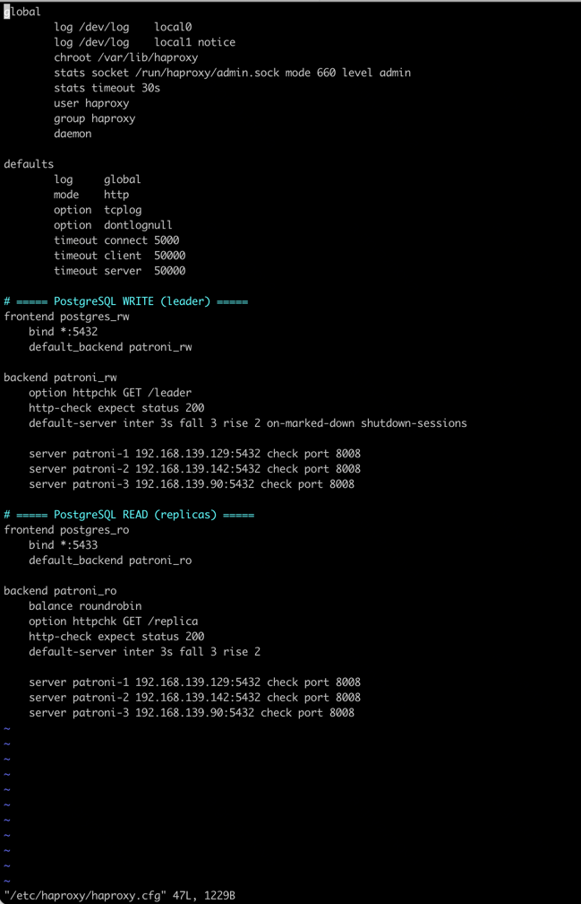

### 6.4. Проверка конфигурации и запуск сервиса

Проверка корректности конфигурации:

```bash
sudo haproxy -c -f /etc/haproxy/haproxy.cfg
```

Перезапуск сервиса HAProxy:

```bash
sudo systemctl enable haproxy
sudo systemctl start haproxy
sudo systemctl status haproxy
```

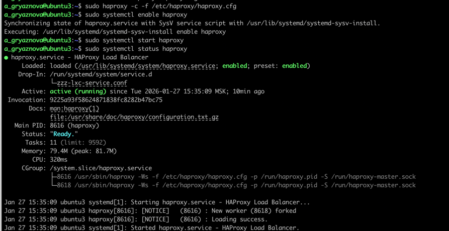

### 6.5. Тестирование работы HAProxy

Для проверки успешного подключения через балансировку нагрузки было выполнено:

```bash
psql -h 192.168.139.90 -p 5432 -U postgres -c "SELECT pg_is_in_recovery(), version();"
```

Результат:

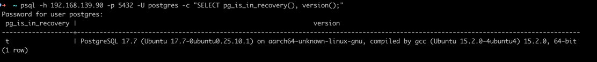

## 7. Подключение кластера PostgreSQL к приложению через HAProxy

На хостовую машину развернуто приложение для бронирования авиабилетов.
Исходный код приложения(Kotlin, Spring): [src](app/backend)

Подключаем базу данных через конфиг в application.yaml:

```yaml
spring:
  datasource:
    url: jdbc:postgresql://192.168.139.90:5000/demo
    username: postgres
    password: postgres
```

При запуске приложения ошибка подключения.
Попытка подключения через терминал:

```
psql "host=192.168.139.90 port=5000 dbname=demo user=postgres gssencmode=disable"
> psql: error: connection to server at "192.168.139.90", port 5000 failed: received invalid response to SSL negotiation: H
```

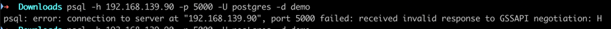

Ошибка говорит, что на порту 5000 сейчас говорит HTTP‑фронтенд HAProxy, а не TCP‑проксирование PostgreSQL, необходимо
поправить конфиг и перезагрузить HAProxy:

```yaml
defaults
  mode    http
```

Исправить на

```yaml
defaults
  mode    tcp
```

Ошибка ушла, приложение работает.

Приложение подтягивает рейсы, есть возможность забронировать и посмотреть бронирования

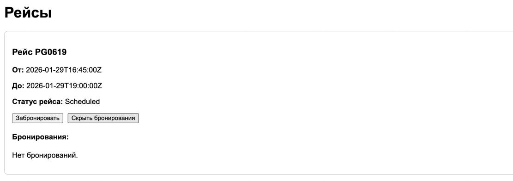
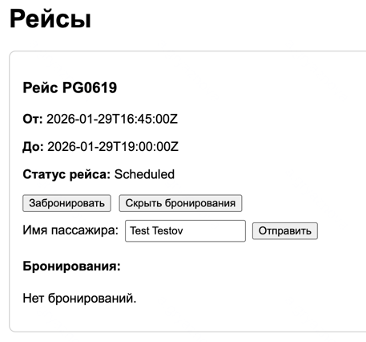
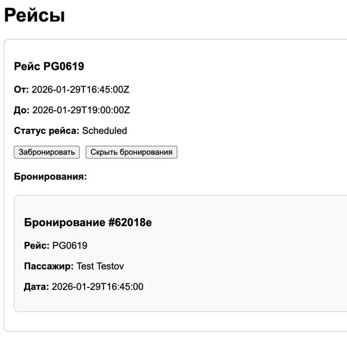

