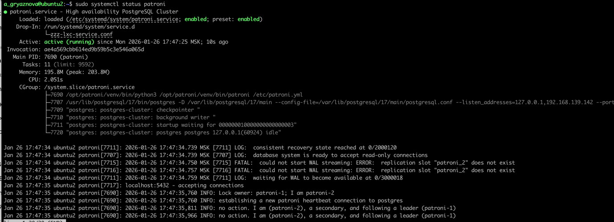

# Создание и тестирование высоконагруженного отказоустойчивого кластера PostgreSQL на базе Patroni

Вот как будет выглядеть ваша инструкция в стиле отчета:

## 1. Создание виртуальных машин в OrbStack

Для реализации отказоустойчивого кластера были созданы три виртуальные машины, на которых планировалась установка
компонентов кластера.

## 2. Установка и настройка etcd

### 2.1. Установка etcd

На каждой виртуальной машине была произведена установка etcd:

```bash
sudo apt update
sudo apt -y install etcd-server
sudo apt -y install etcd-client
sudo systemctl stop etcd
sudo systemctl disable etcd
sudo rm -rf /var/lib/etcd/default 
```


### 2.2. Конфигурирование etcd

Для корректной работы кластера etcd были выполнены следующие настройки на каждой ноде:

#### Первая виртуальная машина

Файл `/etc/default/etcd` был настроен следующим образом:

```
ETCD_NAME="etcd1"
ETCD_DATA_DIR="/var/lib/etcd"
ETCD_LISTEN_PEER_URLS="http://0.0.0.0:2380"
ETCD_LISTEN_CLIENT_URLS="http://0.0.0.0:2379"
ETCD_INITIAL_ADVERTISE_PEER_URLS="http://192.168.139.129:2380"
ETCD_ADVERTISE_CLIENT_URLS="http://192.168.139.129:2379"
ETCD_INITIAL_CLUSTER="etcd1=http://192.168.139.129:2380,etcd2=http://192.168.139.142:2380,etcd3=http://192.168.139.90:2380"
ETCD_INITIAL_CLUSTER_STATE="new"
ETCD_INITIAL_CLUSTER_TOKEN="etcd-cluster-patroni"
ETCD_ELECTION_TIMEOUT="10000"
ETCD_HEARTBEAT_INTERVAL="2000"
ETCD_INITIAL_ELECTION_TICK_ADVANCE="false"
ETCD_ENABLE_V2="true"
```


При попытке запуска etcd служба зависла в состоянии ожидания кворума.


#### Вторая виртуальная машина

Конфигурация для второй ноды:

```
ETCD_NAME="etcd2"
ETCD_DATA_DIR="/var/lib/etcd"
ETCD_LISTEN_PEER_URLS="http://0.0.0.0:2380"
ETCD_LISTEN_CLIENT_URLS="http://0.0.0.0:2379"
ETCD_INITIAL_ADVERTISE_PEER_URLS="http://192.168.139.142:2380"
ETCD_ADVERTISE_CLIENT_URLS="http://192.168.139.142:2379"
...
```


После запуска наблюдалось ожидание кворума.


#### Третья виртуальная машина

Конфигурация для третьей ноды:

```
ETCD_NAME="etcd3"
ETCD_DATA_DIR="/var/lib/etcd"
ETCD_LISTEN_PEER_URLS="http://0.0.0.0:2380"
ETCD_LISTEN_CLIENT_URLS="http://0.0.0.0:2379"
ETCD_INITIAL_ADVERTISE_PEER_URLS="http://192.168.139.90:2380"
ETCD_ADVERTISE_CLIENT_URLS="http://192.168.139.90:2379"
...
```

После настройки всех узлов кластер etcd успешно запустился и ожидает запросов.


### 2.3. Проверка состояния кластера etcd

Для мониторинга состояния кластера были выполнены команды:

```bash
sudo systemctl status etcd
sudo systemctl stop etcd
sudo systemctl is-enabled etcd
sudo systemctl restart etcd
etcdctl endpoint status --cluster -w table
```


### 2.4. Проверка отказоустойчивости

После отключения etcd на одной из нод кластер продолжил работу


## 3. Установка PostgreSQL

**На все три ноды установлен PostgreSQL:**

```bash
sudo apt install curl ca-certificates
sudo install -d /usr/share/postgresql-common/pgdg
sudo curl -o /usr/share/postgresql-common/pgdg/apt.postgresql.org.asc --fail https://www.postgresql.org/media/keys/ACCC4CF8.asc

. /etc/os-release
sudo sh -c "echo 'deb [signed-by=/usr/share/postgresql-common/pgdg/apt.postgresql.org.asc] https://apt.postgresql.org/pub/repos/apt $VERSION_CODENAME-pgdg main' > /etc/apt/sources.list.d/pgdg.list"

sudo apt update
sudo apt install postgresql-17
```


**Создание пользователя replicator и rewind_user:**

```sql
create user replicator replication login encrypted password 'replicator';
create user rewind_user login superuser password 'rewind_user';
```

**Редактирование файла pg_hba.conf:**
```
host all all 0.0.0.0/0 scram-sha-256
host replication replicator 0.0.0.0/0 scram-sha-256
```


**Редактирование файла postgresql.conf:**
```
listen_address = '*'
```

**Проверка, что кластер запущен на всех трех нодах:**

````
sudo -u postgres pg_lsclusters
````


**На второй и третьей ноде удалить содержимое каталога pgdata:**
```bash
sudo systemctl stop postgresql
rm -rf /var/lib/postgresql/17/main/*
```

## 4. Установка Patroni

1. Ставим модуль для создания виртуальных окружений

```bash
sudo apt install python3-venv
```


2. Создаём каталог для Patroni.

```bash
sudo mkdir -p /opt/patroni
```

3. Передаём владение каталогом пользователю postgres

```bash
sudo chown postgres:postgres /opt/patroni
```

4. Создаём виртуальное окружение от имени postgres.

```bash
sudo -u postgres python3 -m venv /opt/patroni/venv
```

5. Устанавливаем Patroni с поддержкой etcd3.

```bash
sudo -u postgres /opt/patroni/venv/bin/pip install 'patroni[etcd3]'
```


6. Устанавливаем драйвер для работы Patroni с PostgreSQL.

```bash
sudo -u postgres /opt/patroni/venv/bin/pip install 'psycopg2-binary'
```


7. Создаём конфигурационный файл Patroni.
```bash
sudo vi /etc/patroni.yml
sudo vi /etc/systemd/system/patroni.service
```

При попытке запустить patroni 


Поскольку устанавливали через виртуальное окружение нужно поменять
```
ExecStart=/usr/local/bin/patroni /etc/patroni.yml
```
на 
```
ExecStart=/opt/patroni/venv/bin/patroni /etc/patroni.yml
```

После рестарта 

```
could not access the server configuration file "/var/lib/postgresql/17/main/postgresql.conf": No such file or directory
```


Пересоздадим каталог с нужными правами:
```bash
sudo systemctl stop postgresql || true
sudo rm -rf /var/lib/postgresql/17/main
sudo mkdir -p /var/lib/postgresql/17/main
sudo chown -R postgres:postgres /var/lib/postgresql/17
sudo chmod 700 /var/lib/postgresql/17/main
```

Первая нода определилась как реплика:


Пересоздадим кластер:

```bash
sudo -u postgres /opt/patroni/venv/bin/patronictl -c /etc/patroni.yml remove postgres-cluster
ETCDCTL_API=2 etcdctl --endpoints="http://192.168.139.129:2379,http://192.168.139.142:2379,http://192.168.139.90:2379" ls /db
```


Проверка
```bash
sudo -u postgres /opt/patroni/venv/bin/patronictl -c /etc/patroni.yml list
```


Проделываем тоже самое на второй и третьей ноде

Ошибка на второй ноде 


Ошибка на третьей ноде


Пересоздадим директории:
```bash
sudo systemctl stop postgresql || true
sudo rm -rf /var/lib/postgresql/17/main
sudo mkdir -p /var/lib/postgresql/17/main
sudo chown -R postgres:postgres /var/lib/postgresql/17
sudo chmod 700 /var/lib/postgresql/17/main
```

После очистки директорий статусы:


Проверка

```bash
sudo -u postgres /opt/patroni/venv/bin/patronictl -c /etc/patroni.yml list
```




