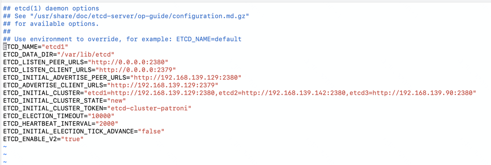
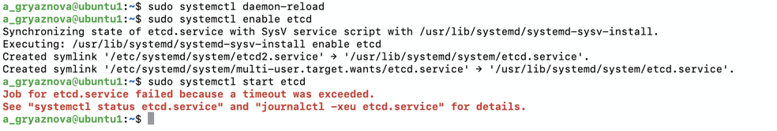
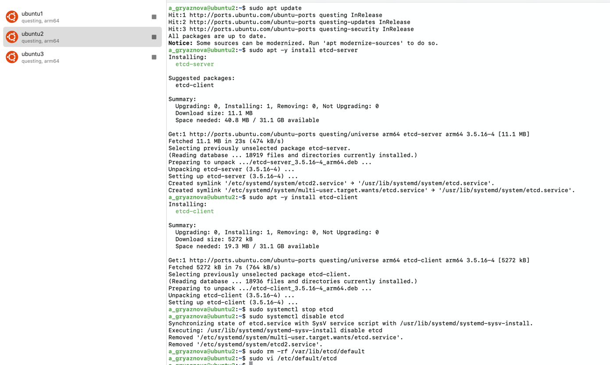
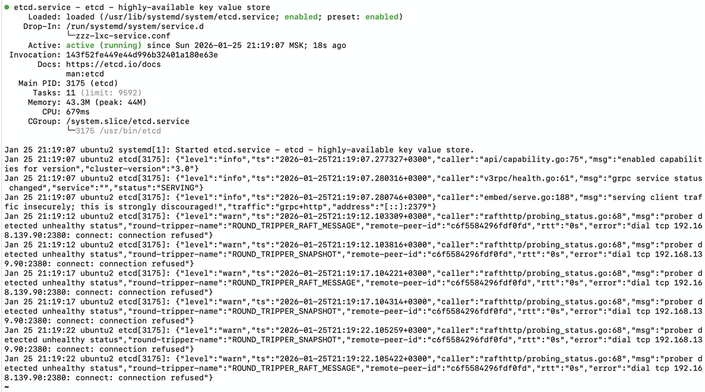
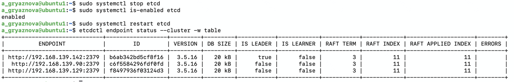

## Создание и тестирование высоконагруженного отказоустойчивого кластера PostgreSQL на базе Patroni

1 создание виртуальных машин в orbstack

### Установка и настройка etcd
1. Установите etcd на каждой виртуальной машине:
```bash
sudo apt update
sudo apt -y install etcd-server
sudo apt -y install etcd-client
sudo systemctl stop etcd
sudo systemctl disable etcd
sudo rm -rf /var/lib/etcd/default 
```


2. Настройка файлов конфигурации

```bash
sudo vi /etc/default/etcd
```

На первой виртуальной машине: 
```
ETCD_NAME="etcd1"
ETCD_DATA_DIR="/var/lib/etcd"
ETCD_LISTEN_PEER_URLS="http://0.0.0.0:2380"
ETCD_LISTEN_CLIENT_URLS="http://0.0.0.0:2379"
ETCD_INITIAL_ADVERTISE_PEER_URLS="http://192.168.139.129:2380"
ETCD_ADVERTISE_CLIENT_URLS="http://192.168.139.129:2379"
ETCD_INITIAL_CLUSTER="etcd1=http://192.168.139.129:2380,etcd2=http://192.168.139.142:2380,etcd3=http://192.168.139.90:2380"
ETCD_INITIAL_CLUSTER_STATE="new"
ETCD_INITIAL_CLUSTER_TOKEN="etcd-cluster-patroni"
ETCD_ELECTION_TIMEOUT="10000"
ETCD_HEARTBEAT_INTERVAL="2000"
ETCD_INITIAL_ELECTION_TICK_ADVANCE="false"
ETCD_ENABLE_V2="true"
```


Попытка запуска etcd:


etcd завис в старте, потому что не видит кворум

Установка и настройка файла конфигурации на второй виртуальной машине:
```
ETCD_NAME="etcd2"
ETCD_DATA_DIR="/var/lib/etcd"
ETCD_LISTEN_PEER_URLS="http://0.0.0.0:2380"
ETCD_LISTEN_CLIENT_URLS="http://0.0.0.0:2379"
ETCD_INITIAL_ADVERTISE_PEER_URLS="http://192.168.139.142:2380"
ETCD_ADVERTISE_CLIENT_URLS="http://192.168.139.142:2379"
...
```


Статус(ожидание кворума):


Установка и настройка файла конфигурации на третьей виртуальной машине:
```
ETCD_NAME="etcd3"
ETCD_DATA_DIR="/var/lib/etcd"
ETCD_LISTEN_PEER_URLS="http://0.0.0.0:2380"
ETCD_LISTEN_CLIENT_URLS="http://0.0.0.0:2379"
ETCD_INITIAL_ADVERTISE_PEER_URLS="http://192.168.139.90:2380"
ETCD_ADVERTISE_CLIENT_URLS="http://192.168.139.90:2379"
...
```
Статус:


Проверка статуса кластера etcd:
```bash
systemctl status etcd
systemctl stop etcd
systemctl is-enabled etcd
systemctl restart etcd
etcdctl endpoint status --cluster -w table
```


При отключении etcd на одной из нод:


2 установка postgresql
3 установка patroni


